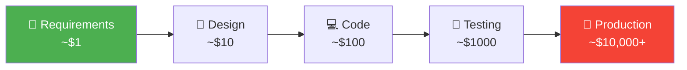
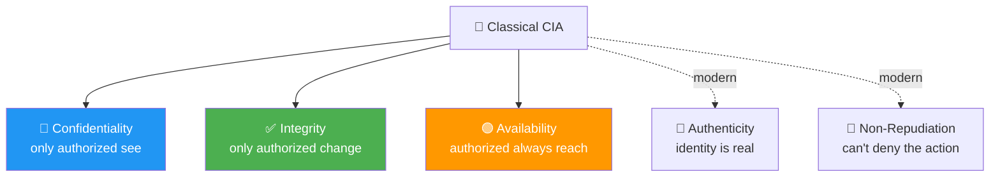
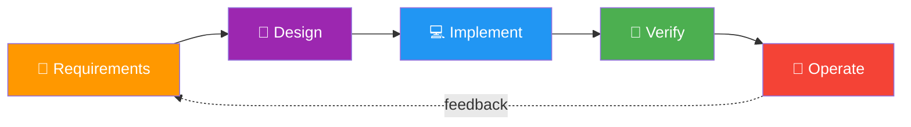

# 📌 Lecture 1 — DevSecOps Foundations: From "Add Security Later" to "Security Everywhere"

---

## 📍 Slide 1 – 💥 The $1.4 Billion Patch That Wasn't Applied

* 🗓️ **March 7, 2017** — Apache discloses **CVE-2017-5638**, an RCE in Struts 2. Patch ships **the same day**. CVSS 10.0
* 📧 March 9: Equifax's security team emails the patch directive across the company
* 🌀 The vulnerable web portal isn't on the inventory the directive used. **It is missed**
* 🗓️ **March 10**: someone is already exploiting it
* 💾 May 13 – July 30: **147 million records** exfiltrated — names, SSNs, birth dates, license numbers
* 🚨 July 29: Equifax discovers the breach. CEO and CISO resign within weeks
* 💰 Final cost: **~$1.4 billion** in remediation + settlements

> 🤔 **Think:** The patch existed. The directive went out. The fix was free. **What process failure cost a billion dollars?** That gap — between "we have a security control" and "the control actually catches the bug" — is what this course is about.

---

## 📍 Slide 2 – 🎯 Learning Outcomes (this lecture)

| # | 🎓 Outcome |
|---|-----------|
| 1 | ✅ Define DevSecOps and explain how it differs from "DevOps + a security tool" |
| 2 | ✅ Place the shift-left philosophy on a real cost-of-defect curve |
| 3 | ✅ Recite the **OWASP Top 10 (2025)** categories and what changed from 2021 |
| 4 | ✅ Walk through three real breaches (Equifax 2017, Capital One 2019, Log4Shell 2021) and identify which DevSecOps practice each one would have caught |
| 5 | ✅ Describe what your DevSecOps pipeline will look like by the end of the course |

---

## 📍 Slide 3 – 🗺️ Course Map: Where We're Going

```mermaid
graph LR
    L1["🏛️ L1 Foundations<br/>(this)"] --> L2["🎯 L2 Threat<br/>modeling"]
    L2 --> L3["🔐 L3 Secure<br/>Git"]
    L3 --> L4["🚀 L4 CI/CD<br/>security"]
    L4 --> L5["🧪 L5 SAST/<br/>DAST"]
    L5 --> L6["🏗️ L6 IaC<br/>scanning"]
    L6 --> L7["📦 L7 Container<br/>security"]
    L7 --> L8["🔏 L8 Supply<br/>chain"]
    L8 --> L9["📊 L9 Runtime +<br/>metrics"]
    L9 --> L10["🎯 L10 Vuln<br/>management"]

    style L1 fill:#FF9800,color:#fff
    style L10 fill:#4CAF50,color:#fff
```



* 🎯 **Through-line:** every lab targets **OWASP Juice Shop** — the most famously broken web app in the world. By Week 10 you'll have run every defensive practice against the same attack surface
* 🪜 **The arc:** culture → modeling → write secure code → ship secure code → scan secure code → secure infrastructure → secure containers → secure supply chain → detect at runtime → triage findings

---

## 📍 Slide 4 – 🍹 The Project: OWASP Juice Shop

* 🏗️ Maintained by **Björn Kimminich** since 2014; OWASP Flagship project since 2018
* 🐛 Ships with **>100 challenges** representing every OWASP Top 10 category and more
* 🚢 Docker one-liner: `docker run -d -p 3000:3000 bkimminich/juice-shop:v19.0.0`
* 🎯 **Why Juice Shop is the canonical learning target:**
  * Realistic stack (Node.js, Angular, SQLite, JWT, file uploads)
  * Bugs are intentional but **realistic** — not "use eval(user_input)" toy examples
  * Has a known set of CVEs to find — your scanner output can be checked against ground truth
* 🧪 Lab 1 deploys it; Labs 4, 5, 7, 8, 10 keep attacking it from different angles

> 💬 *"Juice Shop is a deliberately broken application — but unlike most CTF apps, it's broken in **exactly the way real applications are broken.**"* — Björn Kimminich, OWASP Global AppSec 2022

---

## 📍 Slide 5 – 🧭 What Is DevSecOps?

```mermaid
flowchart LR
    Dev[👩‍💻 Dev] -.--> Build[🏗️]
    Ops[🖥️ Ops] -.--> Build
    Sec[🛡️ Sec] -.--> Build
    Build --> DevSecOps[🚀 DevSecOps<br/>Continuous, automated security<br/>at every stage]

    style DevSecOps fill:#FF9800,color:#fff
```

* 🧑‍🏫 **Definition** (Gartner, Neil MacDonald, 2012): *"DevSecOps is the practice of integrating security controls and processes into the DevOps approach — automated, transparent, and continuous."*
* 🪜 **DevOps + a SAST tool ≠ DevSecOps.** The defining shift is *cultural*: security is **everyone's job**, executed **as code**, **early** and **often**
* 🗓️ The term gained traction at **AWS re:Invent 2015** when teams started publishing pipeline blueprints
* 📚 First book-length treatment: *"DevOpsSec"* by **Jim Bird** (O'Reilly, 2016)
* 🚫 **What DevSecOps is NOT:**
  * Not a tool you buy
  * Not "the security team approves the pipeline"
  * Not a one-time audit before launch

---

## 📍 Slide 6 – 🕰️ A 25-Year Timeline

| 🗓️ Year | 📍 Milestone |
|---|---|
| 2001 | Manifesto for Agile Software Development — Snowbird, UT |
| 2009 | Patrick Debois coins **"DevOps"** at the first DevOpsDays (Ghent, BE) |
| 2010 | OWASP Top 10 first ranked edition |
| 2012 | **Gartner** report introduces *DevSecOps* term — Neil MacDonald |
| 2014 | *More Agile Testing* (Crispin & Gregory) early uses "DevSecOps" in print |
| 2015 | DevSecOps becomes a track at AWS re:Invent + RSA |
| 2016 | First book-length treatment — *DevOpsSec* (Jim Bird, O'Reilly) |
| 2017 | Equifax breach — DevSecOps becomes a boardroom topic |
| 2020 | SolarWinds — supply-chain security joins the agenda |
| 2021 | Log4Shell — runtime detection joins the agenda |
| 2024 | NIST CSF 2.0 adds the *Govern* function |
| 2025 | **OWASP Top 10:2025** published; supply-chain failures get their own category |

---

## 📍 Slide 7 – 💸 The Cost-of-Defect Curve

> 💬 *"The cost of fixing a defect grows roughly 10x at each stage of the SDLC."* — Barry Boehm, *Software Engineering Economics* (Prentice Hall, **1981**)



* 📊 IBM System Sciences (1981) and NIST (2002) studies both confirm the curve. The slope flattens in modern fast-feedback teams, but the **order of magnitude** holds
* 🎯 **DevSecOps in one diagram:** push every security check **as far left** as it will still produce useful signal

---

## 📍 Slide 8 – ⬅️ Shift-Left, Pragmatically

* 🪜 **Shift-Left** = run security checks earlier in the pipeline, where fixes are cheap
* ⚠️ But: *"shift-left" doesn't mean "**only** left"* — runtime threats still need runtime defense (Lecture 9)
* 🪛 **In this course:** every lab maps to a leftward shift of one specific control:

| 🛠️ Control | 📍 Where it shifts to | 🧪 Lab |
|---|---|---|
| Threat modeling | Design | L2 |
| Secret leak detection | Pre-commit | L3 |
| SAST | PR build | L5 |
| SCA / SBOM | Build | L4 |
| IaC scanning | PR build | L6 |
| Image scan | Image build | L7 |
| Signing/verification | Deploy gate | L8 |
| Runtime detection | Cluster | L9 |

* 🧠 The *opposite* of shift-left is "shift-right-only" = a SOC reading post-mortems. Both ends are valid; **the middle is where DevSecOps adds value**

---

## 📍 Slide 9 – 🪜 Three Pillars (Culture, Process, Tools)

| 🏛️ Pillar | 🎯 What it means | 🔥 What goes wrong without it |
|---|---|---|
| 👥 **Culture** | Shared accountability; "if a dev wrote it, a dev fixes it" | Security team becomes the bottleneck; devs throw work over the wall |
| 🛠️ **Process** | Threat modeling, defined SLAs, post-incident reviews | Heroics; same vulns ship every release |
| 🤖 **Tools** | Automated SAST/DAST/SCA/IaC/runtime in the pipeline | Manual scans = quarterly findings dump nobody reads |

* 🪜 The **DORA report** (2022 onward) consistently finds that DevSecOps maturity correlates more with **culture + process** than tool spend
* 🧪 *"Tools are necessary but not sufficient."* If we only taught tools this course would be 3 weeks long. **It's 10 weeks because process and culture matter more.**

---

## 📍 Slide 10 – 🔒 The CIA Triad — and Two Modern Additions



* 🏛️ **CIA Triad:** classical model, dates to a 1976 US Air Force report (Anderson)
* 🪪 **Authenticity** matters now because of phishing + AI-generated content
* 📜 **Non-Repudiation** matters now because of regulatory reporting (GDPR, HIPAA)
* 🧠 Lab 3 (signed commits) is the first non-repudiation control you'll deploy

---

## 📍 Slide 11 – 🏆 OWASP and the Top 10:2025

* 🌐 **OWASP** = Open Worldwide Application Security Project — community-driven non-profit, **founded 2001**
* 🏆 The **Top 10** is a periodic ranking of the most critical web app risks. Releases: **2003, 2004, 2007, 2010, 2013, 2017, 2021, 2025**
* 🆕 **OWASP Top 10:2025** — announced **November 2025**, final release **January 2026** — built on **175,000+ CVE records** + practitioner surveys
* 🔄 **What's new vs 2021:**
  * 🆕 **A02: Software Supply Chain Failures** (replaced/expanded "Vulnerable and Outdated Components")
  * 🆕 **A10: Mishandling of Exceptional Conditions**
  * 🪜 SSRF absorbed into **Broken Access Control** (it was a category of its own in 2021)

---

## 📍 Slide 12 – 🔥 OWASP Top 10:2025 — The List

| # | 🏷️ Category | 🎯 Plain English |
|---|---|---|
| **A01** | Broken Access Control | Users do things they shouldn't be allowed to (now includes SSRF) |
| **A02** | **Software Supply Chain Failures** 🆕 | Compromised libs, broken provenance |
| **A03** | Cryptographic Failures | Weak/missing encryption, hard-coded secrets |
| **A04** | Injection | SQL, NoSQL, command, LDAP — untrusted input as code |
| **A05** | Insecure Design | The *architecture* invites the bug |
| **A06** | Security Misconfiguration | Defaults, debug pages, open S3 buckets |
| **A07** | Identification & Authentication Failures | Weak passwords, broken MFA, session fixation |
| **A08** | Software & Data Integrity Failures | Unsigned updates, unsafe deserialization |
| **A09** | Security Logging & Monitoring Failures | Can't detect because we can't see |
| **A10** | **Mishandling of Exceptional Conditions** 🆕 | Error paths leak info, fail-open instead of fail-closed |

* 🧠 **Every lab in this course defends against at least one A0X category.** Worth bookmarking this slide

---

## 📍 Slide 13 – 💉 Why Injection Hasn't Left the Top 10 in 20 Years

```python
# ❌ Vulnerable — string concatenation
def get_user(username):
    cursor.execute(f"SELECT * FROM users WHERE name = '{username}'")
    # Input: bob' OR '1'='1
    # Becomes: SELECT * FROM users WHERE name = 'bob' OR '1'='1'

# ✅ Safe — parameterized query
def get_user(username):
    cursor.execute("SELECT * FROM users WHERE name = ?", (username,))
```

* 🧠 The fix is **trivial** when developers know it. The teaching problem is that **string concat looks fine** until you imagine an attacker
* 🪜 **Lab 5** (SAST with Semgrep) will catch this exact pattern automatically — your first concrete shift-left win
* 🎯 OWASP Juice Shop ships **6 SQL injection challenges** as of v19; you'll find them with Semgrep before you find them by hand

---

## 📍 Slide 14 – 🔬 Case Study: Capital One (2019)

* 🗓️ **July 19, 2019** — Paige Thompson (former AWS employee) exploits a **misconfigured WAF** at Capital One via **SSRF**
* 🪜 The WAF's IAM role had wildcard `s3:Get*` / `s3:List*` across **700+ buckets**
* 💾 Exfiltration: **106 million records**, 140,000 SSNs
* 💰 Settlement: **$190M**
* 🧠 **The lessons in DevSecOps terms:**
  * 🏗️ **IaC scan** (L6) would have flagged the wildcard IAM
  * 🎯 **Threat modeling** (L2) would have surfaced the metadata service as a trust boundary
  * 📊 **Runtime detection** (L9) on outbound S3 calls would have caught the exfiltration mid-flight

---

## 📍 Slide 15 – 🔬 Case Study: Log4Shell (2021)

* 🗓️ **November 24, 2021** — Alibaba security team discloses CVE-2021-44228 (CVSS 10.0) in **Log4j 2**
* 🌍 **Log4j is everywhere** — embedded in millions of Java apps, including Minecraft, iCloud, Steam, Tesla
* 🐛 The bug: log messages are interpreted as JNDI lookups → arbitrary code execution from a log line
* 🐍 December 9, 2021: PoC goes public. The internet rewrites Christmas plans
* 🧠 **In DevSecOps terms:**
  * 📋 **SBOM** (L4) — could you instantly say *"do my services depend on Log4j 2?"* Most companies couldn't on day one
  * 🔏 **Supply-chain signing** (L8) — verifying provenance doesn't fix vuln deps, but it lets you know *which exact version* you have, fast
  * 📊 **Runtime detection** (L9) — Falco rules for unusual JNDI lookups shipped within 24 hours

> 🤔 **Think:** Log4Shell was a code-level bug, but every defense that worked was at a **higher** layer (SBOM, runtime detection). What does that tell you about defense-in-depth?

---

## 📍 Slide 16 – 🧩 Secure SDLC: The Five Phases



| 🪜 Phase | 🛡️ DevSecOps practice | 🧪 Lab |
|---|---|---|
| Requirements | Security stories, abuse cases | (Lecture-only) |
| Design | Threat modeling (STRIDE), data classification | **L2** |
| Implement | Signed commits, secret scanning, secure coding | **L3** |
| Verify | SAST, DAST, IaC scan, container scan, SBOM/SCA | **L4–L8** |
| Operate | Runtime detection, vuln management, metrics | **L9–L10** |

* 🪜 **The whole point of this course is that practice goes in each phase** — by Week 10 you'll have something running in every one

---

## 📍 Slide 17 – 🪜 Maturity Models — Where You'll End Up

* 🏛️ **OWASP SAMM** — *Software Assurance Maturity Model* — 4 levels × 15 practices. We'll do a proper walkthrough in Lecture 9
* 📊 **BSIMM** — *Building Security In Maturity Model* — descriptive, annual report (BSIMM 16 in January 2026, based on 111 orgs)
* 🪜 A typical org distribution (2026 BSIMM data):
  * Level 0: <10% (no formal program)
  * Level 1: ~40% (ad-hoc, person-dependent)
  * Level 2: ~40% (documented, repeatable)
  * Level 3: ~10% (measured, continuously improved)
* 🎯 **End-of-course goal:** every student should be able to **describe a Level 2 program** and identify *one concrete gap* to push their team toward Level 3 — this is exam-territory material

---

## 📍 Slide 18 – 🏢 Roles in a DevSecOps Team

| 🧑‍💼 Role | 🎯 Responsibility | 👀 Where you meet them in the course |
|---|---|---|
| 👩‍💻 **Developer** | Writes code, runs SAST locally, fixes findings | Every lab |
| 🚀 **DevOps/SRE** | Maintains the pipeline; deploys hardening | L4, L7 |
| 🛡️ **Security Engineer** | Writes detection rules, custom policies | L6, L9 |
| 🦸 **Security Champion** | Developer trained in security; embeds in dev teams | Lecture-only |
| 🎯 **Security Architect** | Designs trust boundaries, signs off threat models | L2 |
| 📊 **Security Manager** | Owns metrics, SLAs, exec reporting | L10 |

* 🪜 **"Security Champion" is the role that scales DevSecOps in real orgs** — one developer per team trained to push back on PRs that ship vulnerable code. Read the OWASP Security Champions Playbook (v2.0, 2024) when you have a quiet hour

---

## 📍 Slide 19 – 🚫 The Five Myths You'll Hear at Your First Job

| 😱 Myth | 🧠 Reality |
|---|---|
| *"Security slows us down"* | DORA 2024: high-performing security teams ship **more often** than low-performing ones |
| *"We'll do security after MVP"* | The MVP becomes legacy; security tech debt compounds at 1.7x/year |
| *"We have a firewall"* | Modern apps speak HTTPS through firewalls; perimeter security is a 1990s mental model |
| *"Our scanner shows 0 critical, so we're secure"* | Scanners find *known* bugs. Your unknowns are your unknowns. (Threat modeling, L2) |
| *"That's the security team's problem"* | The security team can't be in every PR. Distributed ownership is the only model that scales |

* 🧠 You'll hear at least three of these in the first month of any real DevSecOps job. The point of this course is to give you the data + stories to push back without sounding theoretical

---

## 📍 Slide 20 – 📚 Resources & What's Next

**Books to keep on your desk:**

| 📖 Book | ✍️ Why |
|---|---|
| *DevOpsSec* — Jim Bird (O'Reilly, 2016, free PDF) | Still the most accessible DevSecOps overview; 80 pages |
| *Securing DevOps* — Julien Vehent (Manning, 2018) | Real Mozilla pipeline walkthrough; ch. 2 maps tools to phases |
| *The DevOps Handbook* — Kim, Humble, Debois, Willis (2nd ed., 2021) | The DevOps cultural foundation that DevSecOps extends |
| *Web Application Security* — Andrew Hoffman (O'Reilly, 2020) | Companion to Juice Shop attacks; ch. 4 maps to A03/A07 |

**Talks (1–2 hours, worth your time):**

* 🎥 *"Continuous Delivery + DevSecOps: The Marriage"* — Jez Humble, GOTO 2019
* 🎥 *"How Mozilla Does DevSecOps"* — Julien Vehent, AppSec EU 2018
* 🎥 *"OWASP Top 10:2025 — What Changed and Why"* — Andrew van der Stock (OWASP), Global AppSec 2025

**Standards & specs (bookmark them):**

* 📜 [OWASP Top 10:2025](https://owasp.org/Top10/2025/)
* 📜 [OWASP Juice Shop](https://owasp.org/www-project-juice-shop/)
* 📜 [NIST SSDF (SP 800-218)](https://csrc.nist.gov/Projects/ssdf) — the canonical secure-SDLC standard

**Next week:** Lecture 2 — **Threat Modeling with STRIDE and Threagile**. Bring a system diagram of any app you've worked on; we'll model it.

> 💬 *"Security is not a product, but a process."* — Bruce Schneier, *Secrets and Lies* (Wiley, 2000) — and still true 26 years later.
