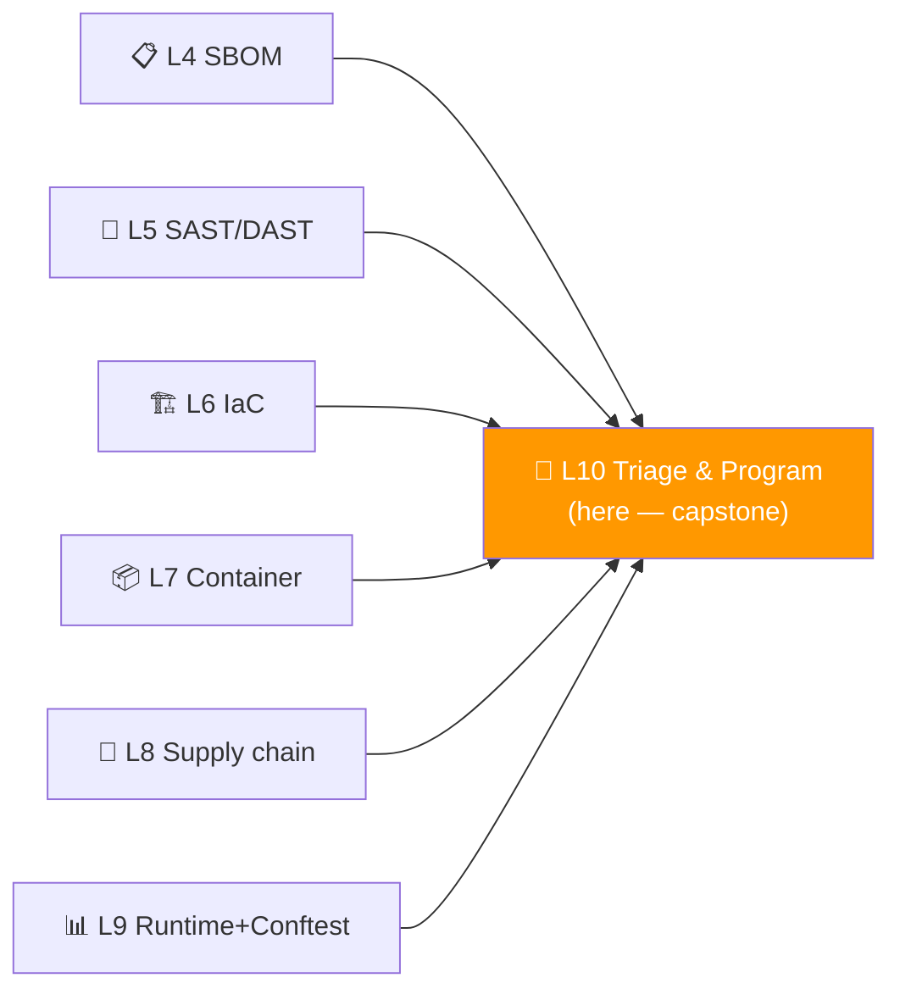
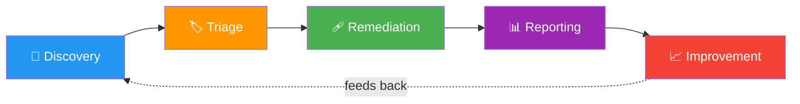
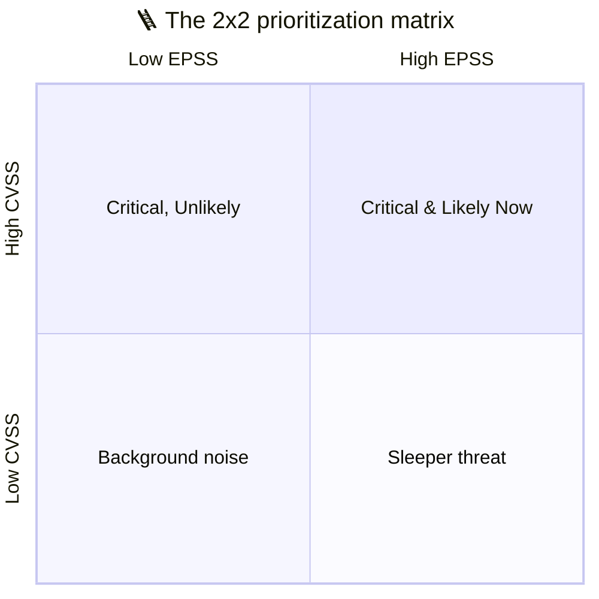
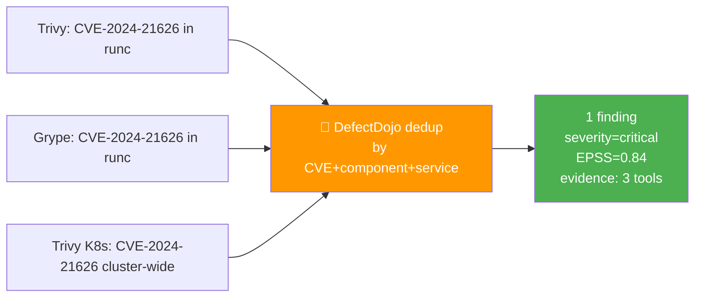
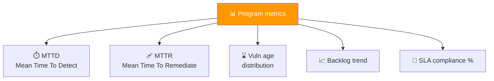

# 📌 Lecture 10 — Vulnerability Management: From 1 000 Findings to a Working Program

---

## 📍 Slide 1 – 📊 The Capstone Lecture

* 🪜 Over the past 9 weeks you've produced finding files from:
  * **L4** SBOM/SCA (Grype, Trivy)
  * **L5** SAST/DAST (Semgrep, ZAP)
  * **L6** IaC scan (Checkov, KICS)
  * **L7** Container scan (Trivy image + config)
  * **L8** Supply chain (Cosign verification logs)
  * **L9** Runtime detection (Falco alerts) + admission (Conftest)
* 📂 If you ran them all on Juice Shop, you'd see **400+ raw findings**
* 🧠 **The hardest engineering question of DevSecOps is not "how do we scan?"** — it's *"now what?"* Lecture 10 answers it

> 🤔 **Think:** Lecture 9 introduced MTTR and vuln-age as program metrics. This lecture is the **workflow** that produces those numbers — without it, you have data, not a program.

---

## 📍 Slide 2 – 🎯 Learning Outcomes

| # | 🎓 Outcome |
|---|-----------|
| 1 | ✅ Walk the **vulnerability management lifecycle**: Discovery → Triage → Remediation → Reporting → Improvement |
| 2 | ✅ Pick a severity score: when to use **CVSS v4.0**, when to use **EPSS** — and why a single score is never enough |
| 3 | ✅ Import scanner outputs into **DefectDojo** and dedupe across tools |
| 4 | ✅ Apply an SLA matrix and compute the program metrics that matter (MTTD/MTTR/vuln-age/backlog trend) |
| 5 | ✅ Build the **interview-ready 5-minute walkthrough** of your DevSecOps program |

---

## 📍 Slide 3 – 🗺️ Where Lecture 10 Sits



* 🪜 **Building on every prior lab.** L10 is the integration lab — every finding from L4–L9 lands in DefectDojo here
* 🎯 **Lab 10 alignment:** Task 1 (DefectDojo setup + import all prior reports), Task 2 (build governance report + program metrics), Bonus (5-minute interview walkthrough — the deliverable an employer will want to hear)

---

## 📍 Slide 4 – 🔄 The Vulnerability Management Lifecycle



| 🪜 Phase | 🎯 What happens | ⏱️ Cadence |
|---|---|---|
| **Discovery** | Scanners run, findings produced | Per PR + nightly |
| **Triage** | Dedup, severity, ownership, SLA assignment | Daily (security on-call) |
| **Remediation** | Fix, suppress with reason, or accept with expiry | Per-finding by SLA |
| **Reporting** | Metrics, audit artifacts, exec dashboard | Weekly/monthly |
| **Improvement** | Tune rules, expand coverage, mature next OWASP SAMM practice | Quarterly |

* 🪜 **The feedback arrow is the program.** A "discovery only" pipeline is a scan farm; the lifecycle is what makes it a program

---

## 📍 Slide 5 – 🎚️ Severity: CVSS v4.0 in Brief

> 💬 *"CVSS was never meant to be a single-number priority. It's a severity vocabulary."* — FIRST CVSS SIG, 2023 onboarding talk

* 🗓️ **CVSS v4.0** — released November 2023; **NVD publishing v4.0 alongside v3.1 since early 2026**
* 🧩 Four metric groups:
  * 🏛️ **Base** — intrinsic + immutable (attack vector, complexity, privileges, impact)
  * 🌐 **Threat** — exploit maturity, threat intelligence (replaces older "Temporal")
  * 🏢 **Environmental** — your asset value, your existing mitigations
  * 🔬 **Supplemental** — non-scored helper context (e.g., "automatable", "safety")
* 🎯 **What this means in practice:**
  * **Base score** alone is one input, not a verdict
  * Combining with **environmental** (is this asset critical to YOU?) personalizes the score
  * CVSS doesn't predict exploitation — for that, use EPSS

---

## 📍 Slide 6 – 📈 EPSS: The Probability of Exploitation

* 🏛️ **EPSS** = Exploit Prediction Scoring System. Maintained by **FIRST** (Forum of Incident Response and Security Teams)
* 🧮 A **daily** probability score (0.0–1.0) that a given CVE will be exploited *in the wild* in the next **30 days**
* 🪜 Built from a machine-learning model trained on:
  * Public exploit code availability (PoC on GitHub, ExploitDB)
  * Known CVE chatter on social media
  * Real exploit telemetry from large IDS/IPS networks
* 📊 **Distribution:** ~95% of CVEs have EPSS < 0.10 (likely never exploited). The 5% with EPSS > 0.50 are where the action is

> 🤔 **Think:** Your scanner returned 100 CVSS-9 findings. EPSS shows 95 of them at <0.05 and 5 at >0.80. Which five do you fix this week?

---

## 📍 Slide 7 – 🎯 CVSS + EPSS = Modern Prioritization



| 🎯 Quadrant | 📋 Action |
|---|---|
| **High CVSS + High EPSS** | Fix this week. SLA-overdriven |
| **High CVSS + Low EPSS** | Plan + track. Most "criticals" live here |
| **Low CVSS + High EPSS** | Watch closely — fast exploitation can outpace severity |
| **Low CVSS + Low EPSS** | Batch with normal maintenance |

* 🪜 **DefectDojo 2026 ingests both CVSS and EPSS** and exposes them in the Rules Engine for auto-prioritization
* 🧠 **Two-axis triage is the 2026 best practice.** Single-axis CVSS-only triage causes patch fatigue

---

## 📍 Slide 8 – 🚦 The SLA Matrix (Recap From L9)

| 🚨 Severity | 🩹 Fix SLA | 📋 Owner | 📣 Escalation |
|---|---|---|---|
| 🔴 Critical (CVSS 9–10 OR EPSS > 0.50) | **24h** | On-call + Security Lead | Page on creation |
| 🟠 High (7–8.9) | **7 days** | Service team | Slack + ticket |
| 🟡 Medium (4–6.9) | **30 days** | Service team | Backlog grooming |
| 🔵 Low (0.1–3.9) | **90 days / accept** | Tech lead | Quarterly review |

* 🧭 The SLA matrix is your **defense for risk acceptance** — accepting a Medium = explicit 30-day exposure, signed off
* 🪜 Without an SLA matrix, every finding becomes "P3 — someday"
* 🪜 **In Lab 10** you'll define the matrix in DefectDojo and apply it to imported findings

---

## 📍 Slide 9 – 🐙 DefectDojo: The Triage Hub

* 🏢 **OWASP project** since 2015; open-source (BSD)
* 🐍 Python/Django; latest **v2.58.x** (May 2026)
* 🎯 **What it does:**
  * Imports **~150** scanner formats (Trivy, Semgrep, ZAP, Grype, Checkov, KICS, Cosign verification, custom JSON)
  * **Deduplicates** across tools (same CVE found by Trivy and Grype = one finding)
  * Applies the SLA matrix
  * Tracks every finding's state through the lifecycle
  * Computes program metrics (MTTD, MTTR, vuln-age, backlog trend)
  * Exposes a JIRA-style API for tickets

```bash
# Lab 10 Task 1 starts here
git clone https://github.com/DefectDojo/django-DefectDojo
docker compose up -d
# UI at http://localhost:8080 (admin password printed by initializer)
```

---

## 📍 Slide 10 – 🪜 The Importer Pattern

```bash
# Lab 10 uses this script to ingest every prior lab's report
curl -X POST "$DD_URL/api/v2/import-scan/" \
  -H "Authorization: Token $DD_TOKEN" \
  -F "scan_type=Trivy Scan" \
  -F "engagement=$ENG_ID" \
  -F "file=@labs/lab7/juice-shop-trivy.json"

# Same shape for Semgrep, ZAP, Grype, Checkov, KICS, Conftest, ...
```

* 🪜 **Every importer follows the same pattern:** `--scan_type` + `--file` + engagement context
* 🧠 **DefectDojo's killer feature** is that **deduplication is automatic** — the same CVE reported by Trivy and Grype becomes one finding with two pieces of evidence

---

## 📍 Slide 11 – 🧮 Dedup, Annotated



* 🪜 Dedup keys (configurable in DefectDojo):
  * CVE ID
  * Vulnerability ID + affected component
  * File path + line (for SAST)
  * URL path + parameter (for DAST)
* 🪜 **Why three tools finding the same CVE matters:** ↑ confidence, ↓ noise. **You triage the finding, not the tool output**

---

## 📍 Slide 12 – 🩹 Remediation States

| 🏷️ State | 🎯 Meaning | 🪜 When |
|---|---|---|
| **Active** | Open, in SLA window | Default for new findings |
| **Verified** | A human has confirmed it's a real issue | After triage |
| **False Positive** | Confirmed not exploitable | Suppress with reason |
| **Risk Accepted** | Real but accepted; **MUST have expiry** | Explicit risk acceptance |
| **Mitigated** | Fixed via code or config change | Verification re-scan passes |
| **Inactive** | Out-of-scope or duplicate | Cleanup |

* 🚨 **Risk Accepted with no expiry** is the silent program killer — DefectDojo enforces an expiry on every acceptance (configurable). **Lab 10 Task 2 will show you how**
* 🧠 **In code review terms:** "False Positive" needs a written justification — the **WHY** that future you will read in a year

---

## 📍 Slide 13 – 📊 The Metrics That Matter



| 📏 Metric | 🧮 Formula | 🎯 What it answers |
|---|---|---|
| MTTD | avg(detected_time − introduced_time) | How fast does our pipeline find issues? |
| MTTR | avg(closed_time − detected_time) | How fast do we fix? |
| Vuln age | now − first_seen, by finding | What's our debt distribution? |
| Backlog trend | open(t) − open(t−Δ) | Are we keeping up? |
| SLA compliance | % closed within their severity SLA | Are we triaging by risk, or by panic? |

* 🪜 **DefectDojo computes all five out of the box.** You don't write SQL; you read dashboards
* 🧠 **Anti-metrics you'll be tempted to measure** (don't): scans run, alerts fired, tools deployed. These reward activity, not outcomes (Lecture 9 warned about this)

---

## 📍 Slide 14 – 📋 Governance Reporting

* 🪜 By Week 10 you'll need to produce a **governance report** that an exec or auditor could read

**Required sections (Lab 10 Task 2):**

| 📑 Section | 🎯 Contents |
|---|---|
| Executive summary | 3-sentence state of the program |
| Findings by severity | Open Critical/High/Medium/Low counts |
| Findings by source | Which scanner produced what; coverage gaps |
| MTTR + age distribution | The 5 metrics above |
| SLA compliance | % within SLA; outstanding overdue findings |
| Risk-accepted items | Listed with expiry dates; due for re-review |
| Next-quarter goals | One concrete SAMM ladder step (from Lecture 9) |

* 🪜 **A 1-page exec summary + 5-page detail = the standard.** Don't write 30 pages; no one will read them. The exec summary is what gets cited in compliance audits

---

## 📍 Slide 15 – 🎤 The 5-Minute Interview Walkthrough

* 🎯 **Lab 10 Bonus**: produce a 5-minute walkthrough script as if you were giving an SRE/DevSecOps interview at a real org
* 🪜 The canonical structure:

```
1. Context  (30s) — "I built a DevSecOps program on OWASP Juice Shop..."
2. Layers   (90s) — Show the diagram: pre-commit, CI, runtime
3. Findings (60s) — "Here are the X criticals I closed; here's the one I risk-accepted, here's why"
4. Metrics  (60s) — "MTTR 4 days; vuln-age median 7 days; SLA compliance 92%"
5. Next     (30s) — "If I had another quarter, I'd ship reproducible builds + SLSA L3"
6. Q&A      (30s budget) — Anticipate two questions
```

* 🧠 This is **the deliverable that gets you hired.** Many DevSecOps interviews boil down to "talk me through your last program." Lab 10 produces exactly this script

---

## 📍 Slide 16 – 🔬 Case Study: Log4Shell Triage (December 2021)

* 🪜 The world's most-cited vuln-management exercise
* 🗓️ **December 9, 2021** — CVE-2021-44228 (Log4Shell) goes public. CVSS 10.0. EPSS spikes to 0.97 within 6 hours

| ⏱️ Time after disclosure | 🩹 Action |
|---|---|
| 0h | NVD entry published; PoC on GitHub |
| 1h | EPSS spikes; orgs start scanning |
| 6h | First mass-exploit campaigns observed in the wild |
| 24h | Apache patch 2.15 released |
| 48h | 2.16 fixes a regression in 2.15 |
| 1 week | 2.17 fixes another bypass |
| 2 weeks | Most CISA-tracked orgs patched |
| 3 months | "Long tail" — embedded Log4j in IoT, appliances, vendor products still vulnerable |

* 🪜 **What separated the teams who closed it in 24h vs 1 month:**
  * 🪜 **An up-to-date SBOM** (L4) — answers *"do we have it?"* in seconds, not weeks
  * 🪜 **A working triage workflow** (L10) — finding → owner → fix → verify
  * 🪜 **A test deploy** of the patched dep — not blind force-push to prod
* 🧠 If you had Lab 4 + Lab 10 already shipped, Log4Shell was a 1-day exercise. If you didn't, it was a quarter-long incident

---

## 📍 Slide 17 – 📊 The "Where to Improve Next" Decision

After Lab 10 you'll have **measured** numbers — open findings, MTTR, vuln-age. The question is **what to improve next**.

| 📊 Symptom | 🎯 Likely improvement |
|---|---|
| High MTTD on certain finding classes | Add coverage (e.g., DAST nightly, not just PR) |
| High MTTR on Mediums | Process problem — assign owners earlier; tighten SLA |
| Increasing backlog | Either you found more bugs (good) or you stopped fixing (bad) — investigate |
| 0 risk-accepted items | Suspicious — every program has some; if 0, you're not measuring |
| Risk-accepted with no expiry | Refuse this in DefectDojo config; require expiry on every acceptance |
| Only one tool finds 80% | Tool diversity is the resilience; add a second scanner of that class |

* 🪜 **This is OWASP SAMM in practice** — the maturity ladder from Lecture 9 becomes concrete data-driven decisions here
* 🧠 **One concrete next-quarter goal** is the right cadence. Don't try to mature five practices simultaneously

---

## 📍 Slide 18 – 🪜 Common Mistakes & Fixes

| 🚨 Mistake | 🛠️ Fix |
|---|---|
| Scanning but never importing | DefectDojo (or its replacement) — without a central hub, you have 9 dashboards and no program |
| CVSS-only triage | Add EPSS; the 2x2 matrix is the 2026 standard |
| "Risk Accepted" without expiry | Refuse in DefectDojo rules — every accept needs an expiry date |
| Same finding open for 6 months at HIGH | The SLA matrix is the program; if Mediums sit for months, the matrix isn't enforced |
| Reporting in PDFs nobody reads | Live dashboard + 1-page exec summary; the PDF was a Word-era artifact |
| Skipping the postmortem | When a finding becomes an incident, the postmortem feeds Improvement back into Discovery |

---

## 📍 Slide 19 – ⏭️ What You've Built + What's Next After This Course

* 🧪 **Lab 10** (this week):
  * Task 1 (6 pts): Spin up DefectDojo locally; import every report from Labs 4–9
  * Task 2 (4 pts): Build a governance report with metrics + SLA + risk accept items
  * Bonus (2 pts): 5-minute walkthrough script for an interview
* 🎓 **By the end of this lab you'll have:**
  * Every defensive practice from L1–L9 ran against Juice Shop
  * Findings centralized in DefectDojo
  * Metrics + governance report ready
  * A walkthrough script you can use in your next interview
* 🚀 **After this course:**
  * Read *Securing DevOps* (Vehent) cover-to-cover; you'll recognize every chapter
  * Pick a real open-source project, run the same labs on it; that's your portfolio
  * Track CVE-2024-3094 (xz) postmortem reporting through 2026 — there's still more to learn

---

## 📍 Slide 20 – 📚 Resources & Takeaways

**Books:**

| 📖 Book | ✍️ Why |
|---|---|
| *Application Security Program Handbook* — Derek Fisher (Manning, 2023) | Best single book on program metrics + SLAs |
| *Building Secure & Reliable Systems* — Google (O'Reilly, 2020, free PDF) | Ch. 21 *"Postmortems"* is the canonical reference |
| *Securing DevOps* — Julien Vehent (Manning, 2018) | Ch. 9–10 cover the metrics + program loop directly |
| *Resilience Engineering in Practice* — Hollnagel et al. (CRC, 2011) | Where DevSecOps program improvement borrows its theory |

**Talks & specs:**

* 🎥 *"The DefectDojo Project: 10 Years In"* — Greg Anderson (OWASP), Global AppSec 2024
* 🎥 *"EPSS: Beyond CVSS"* — Jay Jacobs (FIRST), Black Hat 2023
* 📜 [CVSS v4.0 Specification](https://www.first.org/cvss/v4.0/specification-document)
* 📜 [EPSS Data + Model](https://www.first.org/epss/)
* 📜 [DefectDojo Documentation](https://docs.defectdojo.com/)

**Takeaways:**

| # | 🧠 Insight |
|---|---|
| 1 | Discovery is the easy part. Triage + Remediation + Reporting + Improvement are the program. |
| 2 | CVSS = severity. EPSS = likelihood. Use both — neither alone tells the full story. |
| 3 | The SLA matrix is the program. Without it, every finding is "someday." |
| 4 | DefectDojo dedupes across tools; you triage the *finding*, not the tool output. |
| 5 | "Risk Accepted" with no expiry is the silent program killer. Every accept needs a re-review date. |
| 6 | The 5-minute walkthrough script (Lab 10 Bonus) is your interview deliverable. Make it real. |

> 💬 *"Vulnerability management is the discipline of knowing what you have, knowing what's wrong with it, and proving to someone else you fixed it on time."* — Derek Fisher, *Application Security Program Handbook* (2023). The end of this course; the start of your career.
