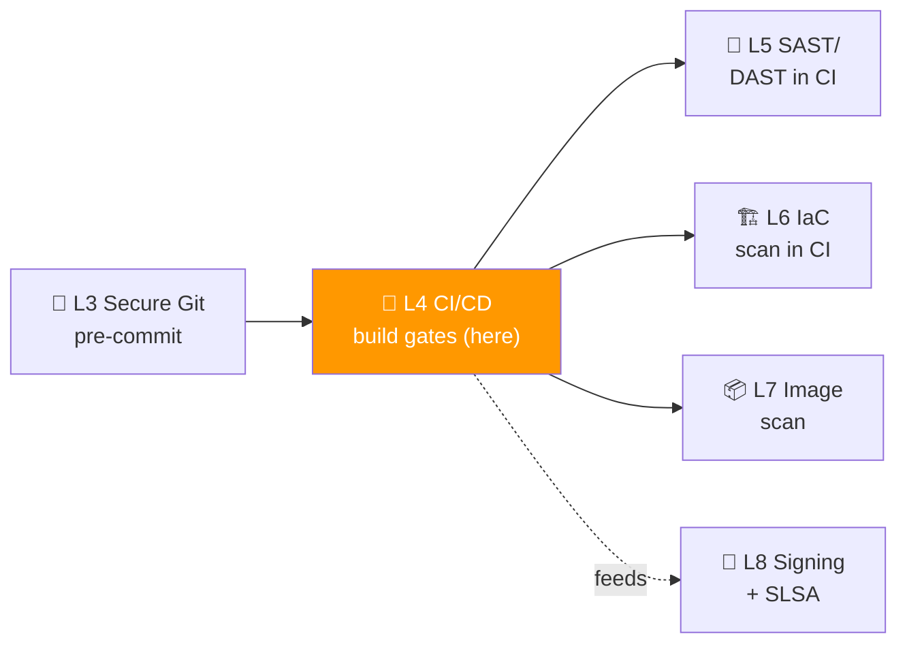
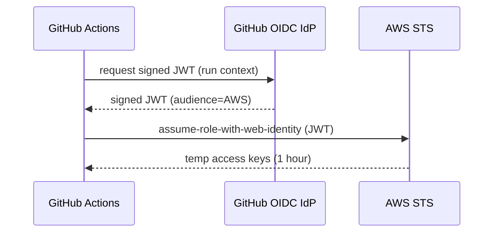
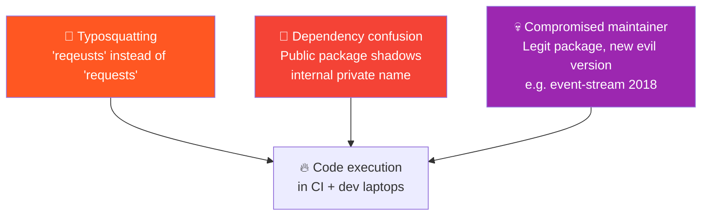

# 📌 Lecture 4 — CI/CD Security: Treating the Pipeline as an Attackable System

---

## 📍 Slide 1 – 🪤 SUNBURST: When the Build Was the Attack

* 🗓️ **March 2020** — attackers (later attributed to APT29) inject **SUNBURST** into SolarWinds' Orion build server. They don't modify the source code in Git — they modify the **MSBuild process** to swap a legitimate `.dll` with a backdoored one **only during release builds**
* 📦 The backdoored update ships to **~18,000 customers** including DoD, Treasury, US Postal Service, FireEye
* 🪜 Source-code review wouldn't have caught it. SAST wouldn't have caught it. **The pipeline was the malware delivery mechanism.**
* 💀 Estimated cost: $100B+ worldwide; multiple government agencies still doing forensic work in 2026
* 🧠 **The lesson:** if your security model assumes the CI server is trusted, you've already lost. The pipeline must be modelled, monitored, and signed — like any other production system

> 🤔 **Think:** You just learned in Lecture 3 to sign your commits. If the commit is signed but the **build** isn't, what stops a SUNBURST-style attack?

---

## 📍 Slide 2 – 🎯 Learning Outcomes

| # | 🎓 Outcome |
|---|-----------|
| 1 | ✅ Recite the OWASP **Top 10 CI/CD Security Risks** and recognize each in a real workflow |
| 2 | ✅ Apply the four core GitHub Actions hardening rules (pin-by-SHA, least-privilege token, OIDC, runner hardening) |
| 3 | ✅ Explain what a **Poisoned Pipeline Execution (PPE)** attack is and how to prevent it |
| 4 | ✅ Locate your build's SLSA Build Level and identify one step to move up |
| 5 | ✅ Wire **SBOM generation** (Syft) + **SCA** (Grype / Trivy) into a CI job that fails the build on a fixable CVE |

---

## 📍 Slide 3 – 🗺️ Where Lecture 4 Sits



* 🪜 **Building on L3:** pre-commit hooks catch what we *can* on the laptop; CI catches **everything else** — and acts as the gate before deployment
* 🎯 **Lab 4 alignment:** wire SBOM (Syft) + SCA (Grype, Trivy) into a real GitHub Actions workflow; the bonus task produces the SBOM that Lab 8 will later sign

---

## 📍 Slide 4 – 📜 What "CI/CD" Actually Is

* 🪜 **CI** — Continuous Integration. Coined by **Grady Booch** (1991); operationalized by **Kent Beck** in Extreme Programming (1999). Merge changes often, run automated checks
* 🚀 **CD** — Continuous Delivery: every commit produces a deployable artifact (Humble & Farley, *Continuous Delivery*, 2010). Continuous Deployment goes further — auto-deploy if checks pass
* 🛠️ **The pipeline = a program that builds programs.** That makes it a high-value target, especially since pipelines run with:
  * Privileged credentials (cloud roles, push tokens)
  * Read access to all source code
  * Write access to package registries (`ghcr.io`, npm, PyPI)
  * Network egress to wherever they need to fetch

> 💬 *"In modern systems, the build server is your most over-privileged service."* — Adam Boozer (Datadog Security), KubeCon NA 2023

---

## 📍 Slide 5 – 🎯 OWASP Top 10 CI/CD Security Risks

Originally released **2022**, updated 2024. Memorize the categories; you'll see them on every interview.

| # | 🚨 Risk | 💡 Plain English |
|---|---|---|
| **CICD-SEC-1** | Insufficient Flow Control | Anyone can trigger a deploy; no approval gates |
| **CICD-SEC-2** | Inadequate IAM | Same account does dev + build + deploy |
| **CICD-SEC-3** | Dependency Chain Abuse | Typosquatting, dependency confusion, malicious packages |
| **CICD-SEC-4** | Poisoned Pipeline Execution | Attacker controls a PR that modifies the pipeline itself |
| **CICD-SEC-5** | Insufficient Pipeline-Based Access Controls | Once in the pipeline, anything reaches anything |
| **CICD-SEC-6** | Insufficient Credential Hygiene | Long-lived tokens; secrets in env vars without rotation |
| **CICD-SEC-7** | Insecure System Configuration | Default runner images, no isolation |
| **CICD-SEC-8** | Ungoverned Use of Third-Party Services | `uses: random-user/action@main` |
| **CICD-SEC-9** | Improper Artifact Integrity Validation | No signing, no verification at deploy |
| **CICD-SEC-10** | Insufficient Logging and Visibility | Can't reconstruct what the pipeline did |

* 🧠 **Every lab in this course addresses at least one risk.** L4 covers 3, 4, 6, 8, 9 directly

---

## 📍 Slide 6 – 🔥 Poisoned Pipeline Execution (PPE) — The Bug Class You Must Know

```yaml
# ❌ Vulnerable workflow
on:
  pull_request_target:           # 🚨 RUNS WITH WRITE PERMISSIONS ON FORK PRs
    types: [opened]
jobs:
  test:
    runs-on: ubuntu-latest
    steps:
      - uses: actions/checkout@v4
        with:
          ref: ${{ github.event.pull_request.head.sha }}   # 🚨 Checks out attacker's code
      - run: npm test           # 🚨 Attacker code now runs WITH WRITE TOKEN
```

* 🪜 **What goes wrong:** `pull_request_target` runs in the context of the **target repo**, not the fork. Combine it with checking out the fork's code → attacker executes arbitrary commands with your repo's write token
* 🪜 **Real exploit:** GitHub's own Github-Octo-OctoCore had a PPE bug disclosed via bug bounty 2022; resulted in a $25k payout
* 🛡️ **Fix:** never use `pull_request_target` to run untrusted code. If you must, gate behind explicit approval (manual workflow_dispatch)

> 💬 *"PPE is the SQL injection of CI/CD — same shape, same severity, and just as preventable once you know the pattern."* — Yaron Avital (Palo Alto Unit 42), 2023

---

## 📍 Slide 7 – 🔐 GitHub Actions: The Four Hardening Rules

```yaml
# ✅ Hardened workflow header
permissions:
  contents: read              # 1️⃣ Least privilege at workflow level
  id-token: write             # 3️⃣ OIDC

jobs:
  build:
    runs-on: ubuntu-latest
    steps:
      - uses: step-security/harden-runner@v2.10.4   # 4️⃣ Egress monitoring
        with:
          egress-policy: audit
      - uses: actions/checkout@b4ffde65f46336ab88eb53be808477a3936bae11  # 2️⃣ Pin by SHA
        with:
          fetch-depth: 0
      - uses: aws-actions/configure-aws-credentials@v4.0.2
        with:
          role-to-assume: arn:aws:iam::123:role/deploy
          aws-region: us-east-1
          # No long-lived secret — OIDC handshake
```

| 🪜 Rule | 🎯 What it does | 🚨 Risk it addresses |
|---|---|---|
| **1. Least-privilege `permissions:`** | Workflow's `GITHUB_TOKEN` defaults to read-only | CICD-SEC-2/5 |
| **2. Pin actions by SHA (not tag)** | A `v4` tag can be re-pointed; a 40-char SHA cannot | CICD-SEC-3/8 |
| **3. OIDC for cloud auth** | Short-lived token issued per run; no static AWS keys | CICD-SEC-6 |
| **4. `harden-runner`** | Detects + blocks unexpected egress (StepSecurity) | CICD-SEC-7 |

* 🧠 In this course's labs you'll see SHA pins. **In real life: use `dependabot` to keep them up to date.** Pinning ≠ never updating

---

## 📍 Slide 8 – 🪜 Pinning, in More Detail

```yaml
- uses: actions/checkout@v4              # ❌ Tag — re-pointable
- uses: actions/checkout@v4.2.1          # ⚠️ Better, but still a tag
- uses: actions/checkout@b4ffde6...      # ✅ SHA — immutable
```

* 🪜 **2024 case:** the `tj-actions/changed-files` action was compromised; the maintainer's account was breached and **all version tags v1–v45 were silently re-pointed** to a malicious commit. Anyone using `@v45` or `@main` ran the malicious code; anyone pinned to a SHA was safe
* 🛠️ Tools that help:
  * `pin-github-action` (zgosalvez) — bulk-pin and add a comment with the original tag
  * `dependabot` with `package-ecosystem: github-actions` — opens PRs to bump pinned SHAs
  * `gh attestation verify` — verifies an action's provenance (Lab 8 covers Cosign + provenance)

---

## 📍 Slide 9 – 🪪 OIDC: Goodbye, Long-Lived Cloud Keys



* 🪜 **GitHub introduced OIDC support in October 2021.** AWS, GCP, Azure all support it natively
* 🎯 **Why this matters:** static `AWS_SECRET_ACCESS_KEY` in repo secrets = long-lived bearer token. Compromise → unlimited blast radius (Capital One 2019 had this exact pattern)
* 🪜 With OIDC, the only secret stored in GitHub is a **trust policy** mapping `repo:owner/repo:ref:branch` to an IAM role. The token doesn't exist until the run starts; it dies an hour later
* 🪜 In Lab 4 you'll see OIDC referenced; Lab 7 (container image push) uses it for real

---

## 📍 Slide 10 – 🛡️ Dependency Chain Abuse: 3 Patterns



* 🚨 **Dependency confusion** (Alex Birsan, 2021): published public packages with names matching big-co internal packages → 35+ companies ran his code, including Apple, Microsoft, PayPal. Each got a $30–40k bug bounty
* 💀 **`event-stream` (2018):** popular npm package, ~2M weekly downloads. Maintainer handed off control to a stranger. Stranger added a payload that drained crypto wallets. Discovered weeks later
* 🛡️ **Mitigations in CI:**
  * **Lockfiles** (`package-lock.json`, `Pipfile.lock`, etc.) — version-pin transitively
  * **SCA scanners** (Lab 4): Grype, Trivy match installed deps against CVE DBs
  * **SBOM generation** (Lab 4 Task 1): you can't audit what you can't list

---

## 📍 Slide 11 – 📋 SBOM: The Pipeline's Bill of Materials

> 💬 *"Just as a food product has a nutrition label, software should have a 'bill of materials.'"* — CISA, *SBOM Minimum Elements* (NTIA, 2021)

* 📜 **SBOM = Software Bill of Materials.** Machine-readable list of every component + version in your artifact
* 🪜 Two standards (both fine):
  * **CycloneDX** (OWASP project, since 2017) — JSON/XML; popular in security tooling
  * **SPDX** (Linux Foundation, ISO/IEC 5962:2021) — JSON/RDF; popular in compliance/legal

* 🪜 **SBOM tools in this course (Lab 4):**
  * **Syft** (Anchore, 2020) — generates SBOM from images/dirs in both formats
  * **Grype** — consumes the SBOM, returns CVEs
  * **Trivy** — does both in one tool (slightly different DBs)

* 🎯 **Why it matters:** when the next Log4Shell happens, *"do my services depend on this library?"* must be answerable in **minutes**, not weeks

---

## 📍 Slide 12 – 🪜 A Minimal CI Security Job

```yaml
# .github/workflows/security.yml
name: Security Scan
on: [pull_request]

permissions:
  contents: read
  security-events: write    # upload SARIF

jobs:
  scan:
    runs-on: ubuntu-latest
    steps:
      - uses: actions/checkout@b4ffde6...
      - name: Generate SBOM (Syft)
        uses: anchore/sbom-action@v0.17.5
        with:
          format: cyclonedx-json
          output-file: sbom.cdx.json
      - name: Scan SBOM (Grype)
        uses: anchore/scan-action@v4
        with:
          sbom: sbom.cdx.json
          fail-build: true
          severity-cutoff: high
      - name: Upload SARIF
        uses: github/codeql-action/upload-sarif@v3
        with:
          sarif_file: results.sarif
```

| 🧩 Step | 🎯 What it does |
|---|---|
| Syft step | Produces a CycloneDX SBOM |
| Grype step | Scans the SBOM, fails the build on HIGH+ |
| SARIF upload | Sends findings to GitHub Security tab |

* 🪜 **Three artifacts from one job:** SBOM (for L8 signing), CVE report (for L10 triage), SARIF (for GitHub UI). One pipeline, everywhere downstream wins

---

## 📍 Slide 13 – 🛡️ SLSA: A Maturity Ladder for Build Trust

* 🏛️ **SLSA** (Supply-chain Levels for Software Artifacts, pronounced "salsa") — OpenSSF project, **v1.0 released April 2023**
* 🪜 Four Build Levels (v1.0 renamed from earlier 1-4 levels):

| 🪜 Level | 🎯 Requirement | 🛠️ Typical mechanism |
|---|---|---|
| **Build L1** | Provenance exists | Build script writes a record |
| **Build L2** | Provenance is signed | Cosign / Sigstore signs |
| **Build L3** | Build platform itself is hardened, non-falsifiable | GitHub Actions OIDC + reusable workflow |
| **(Build L4 — withdrawn)** | Reproducible builds | Was too aspirational; cut in v1.0 |

* 🎯 **GitHub Actions can produce SLSA Build Level 3** for free via the `slsa-github-generator` repo or the newer `gh attestation` workflow
* 🪜 Lab 8 will sign Juice Shop's image with Cosign and verify provenance — that's where you'll *experience* the levels

---

## 📍 Slide 14 – 🔬 Case Study: Codecov Bash Uploader (2021)

* 🗓️ **April 15, 2021** — Codecov discovers attackers modified their `bash` uploader (downloaded via `curl | bash` by thousands of CI pipelines) to **exfiltrate environment variables**
* 🎯 Customer fallout: HashiCorp, Twilio, Mozilla, Rapid7, Linux Foundation, GoDaddy — all rotated their CI secrets emergency-style
* 🧠 **Why this lecture, not lecture 3 (where we mentioned it briefly):** Codecov is the textbook example of *Ungoverned Use of Third-Party Services* (CICD-SEC-8) + *Improper Artifact Integrity Validation* (CICD-SEC-9)
* 🛡️ **What would have helped:**
  * **Pin by hash** instead of `curl | bash <latest>`
  * **Cosign verify** the script before execution (Lab 8 Bonus task does this on a smaller scale)
  * **Egress monitoring** (StepSecurity harden-runner would have alerted on the exfiltration domain)

---

## 📍 Slide 15 – 🔬 Case Study: `tj-actions/changed-files` (2024)

* 🗓️ **2024** — the maintainer's GitHub account was compromised; attackers re-tagged **every release from v1 to v45** to point to a malicious commit. Anyone using the action with a tag pulled the malware
* 📊 **Scope:** an estimated **70,000+ repos** were affected; the action sees ~2M downloads/month
* 🪜 **What protected the secure users:** SHA pinning. `@v45` pulled malicious code; `@a1b2c3d...` (the immutable hash) pulled the safe version
* 🧠 This is the strongest case for `dependabot`-driven SHA pinning in your workflows. Tags are convenient. Convenience is what gets exploited

> 💬 *"If you don't pin your dependencies, your dependencies pin you."* — anonymous DevSecOps Twitter, 2024

---

## 📍 Slide 16 – 🧪 Reusable Workflows: Centralizing Security

```yaml
# .github/workflows/secure-build.yml — defined ONCE in a central repo
name: Secure Build (reusable)
on:
  workflow_call:
    inputs:
      image-name: { required: true, type: string }
jobs:
  build:
    permissions:
      contents: read
      id-token: write
      attestations: write
      packages: write
    runs-on: ubuntu-latest
    steps:
      - uses: actions/checkout@b4ffde6...
      - uses: anchore/sbom-action@v0.17.5
      - uses: anchore/scan-action@v4
      # ...build + push + attest...

# .github/workflows/app.yml — uses it from ANY service repo
jobs:
  call-secure-build:
    uses: my-org/.github/.github/workflows/secure-build.yml@v1.0.0
    with:
      image-name: my-app
```

* 🪜 **Centralization pattern that scales:** platform team owns one secure-build workflow; every service repo *calls* it via `workflow_call`. Hardening updates ship once
* 🎯 GitHub's own docs use this pattern to demonstrate SLSA Build L3
* 🛠️ Reusable workflows can also enforce **org-wide policies** that individual repos can't bypass

---

## 📍 Slide 17 – 🧮 Logging the Pipeline Itself

* 📊 **CICD-SEC-10** — Insufficient Logging — is the *quietest* failure mode. The pipeline runs, something looks off in production a week later, and you can't reconstruct **which workflow** built **which artifact** with **which input**
* 🪜 Minimum viable logging:
  * Every workflow run logs its inputs, outputs, and SHA of every action used
  * Every artifact pushed to a registry has provenance (Lab 8)
  * Every deploy logs which artifact it pulled
* 🪜 GitHub's `audit_log` API (Enterprise + Team plans) captures the workflow itself — *who triggered this rerun?* This is the data Lecture 10 will use to compute MTTR for security fixes

> 💬 *"You can't have CI/CD security without CI/CD observability. The pipeline must be debuggable forensically."* — Datadog CI Visibility launch keynote, 2023

---

## 📍 Slide 18 – 🪜 Common Mistakes & Fixes

| 🚨 Mistake | 🛠️ Fix |
|---|---|
| `uses: third-party/action@main` | Pin by SHA; let dependabot keep it fresh |
| `permissions:` block missing (defaults to RW everywhere) | Always set explicit, narrow `permissions:` at workflow + job level |
| Static `AWS_ACCESS_KEY_ID` in repo secrets | OIDC with role-trust policy |
| `pull_request_target` + checkout of `head.sha` | Guard with manual approval workflow, or use `pull_request` (which has no write token) |
| `continue-on-error: true` on the security job | The security gate that doesn't gate is decoration; if you must allow exceptions, do it per-rule, not per-job |

* 🧠 The single most useful audit: `grep -r 'pull_request_target' .github/workflows/` across your org. Almost every PPE bug has this string in the YAML

---

## 📍 Slide 19 – ⏭️ What's Next + Lab Preview

* 🧪 **Lab 4** (this week):
  * Task 1 (6 pts): Generate SBOM (Syft) + scan (Grype) on Juice Shop image
  * Task 2 (4 pts): Compare Trivy all-in-one against the Syft+Grype split — same image, different tools
  * Bonus (2 pts): Produce a **CycloneDX SBOM** that Lab 8 will use as an attestation subject
* 🚀 **Lecture 5** (next week): **SAST + DAST** — we add the two scanner types that actually look at *your application code* and *running app*. Lab 5 runs both against Juice Shop
* 🪜 Everything we build from here ships through the CI pipeline you'll hardened today

---

## 📍 Slide 20 – 📚 Resources & Takeaways

**Books:**

| 📖 Book | ✍️ Why |
|---|---|
| *Software Supply Chain Security* — Cassie Crossley (Manning, 2024) | Best single book; ch. 4–5 are the CI/CD chapters |
| *Continuous Delivery* — Humble & Farley (Addison-Wesley, 2010) | The CI/CD canonical text; ch. 14 *"Advanced Version Control"* dovetails with this lecture |
| *Securing DevOps* — Julien Vehent (Manning, 2018) | Real Mozilla pipeline — every artifact in this lecture has a Mozilla original |

**Talks & specs:**

* 🎥 *"Securing the GitHub Actions Marketplace"* — GitHub Security, GitHub Universe 2023
* 🎥 *"Inside the SolarWinds Build Compromise"* — CrowdStrike + FireEye joint session, RSA 2021
* 📜 [OWASP Top 10 CI/CD Risks](https://owasp.org/www-project-top-10-ci-cd-security-risks/)
* 📜 [SLSA v1.0](https://slsa.dev/spec/v1.0/)
* 📜 [GitHub Actions hardening guide](https://docs.github.com/en/actions/security-guides/security-hardening-for-github-actions)
* 📜 [StepSecurity Harden Runner](https://github.com/step-security/harden-runner)

**Takeaways:**

| # | 🧠 Insight |
|---|---|
| 1 | The build server is your most over-privileged service. Threat-model it. |
| 2 | Pin actions by SHA; let dependabot keep them fresh. Tags are not immutable. |
| 3 | OIDC ends long-lived cloud keys. If you still have an `AWS_SECRET_ACCESS_KEY` in repo secrets, you have homework. |
| 4 | SBOM is non-optional in 2026. Generate it once, reuse it for SCA, signing, and incident response. |
| 5 | PPE is the SQL injection of CI/CD. `pull_request_target` + checkout-untrusted-code = critical. |
| 6 | SLSA Build Level 3 is achievable on free GitHub Actions via reusable workflows. Aim for it. |

> 💬 *"In security, the most expensive bug is the one you can't see. CI/CD observability is what makes the bug see-able."* — adapted from Charity Majors, *Observability Engineering* (O'Reilly, 2022).
