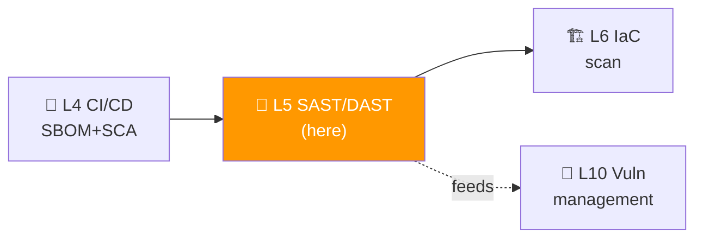
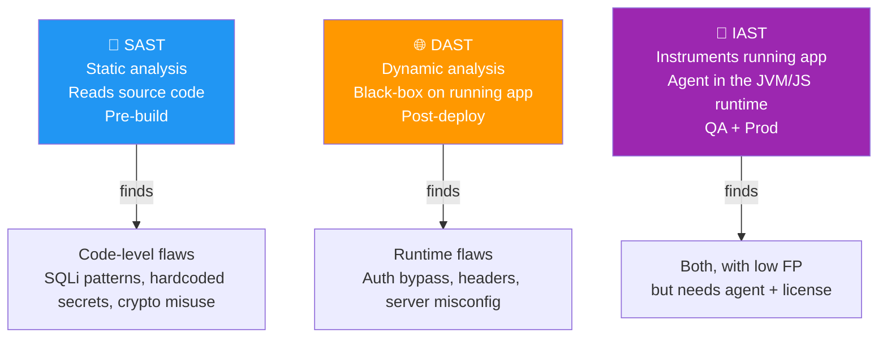
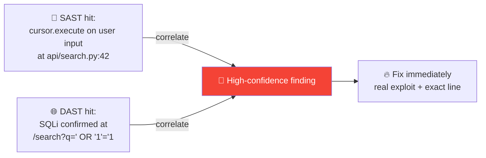

# 📌 Lecture 5 — SAST + DAST: Reading the Code, Then Watching It Run

---

## 📍 Slide 1 – 🍷 Heartbleed: The Two-Byte Read That Bled Half the Internet

* 🗓️ **April 7, 2014** — Codenomicon + Google researchers disclose CVE-2014-0160 in OpenSSL — a **read-out-of-bounds** in the TLS heartbeat extension introduced two years earlier
* 🌍 OpenSSL powers TLS for **~17% of all internet-facing servers** at the time. Every one of them leaked **64KB of memory per heartbeat** to anyone who asked
* 🎫 What attackers extracted: private keys, session cookies, passwords, API tokens — all silently, no log entry
* 🪜 **A simple bounds check would have fixed it.** A *modern SAST scanner* — looking for `memcpy` with attacker-controlled length — would have caught it
* 🪜 **A modern fuzzer or DAST tool** sending a malformed heartbeat would have seen the response leak memory
* 💀 Cost to the industry: estimated **>$500M** in cert rotation alone, plus uncountable downstream breaches

> 🤔 **Think:** This lecture is about the two tool classes that read the code **at rest** (SAST) and watch it **in motion** (DAST). Each one would have caught Heartbleed. The teaching question is *why we need both.*

---

## 📍 Slide 2 – 🎯 Learning Outcomes

| # | 🎓 Outcome |
|---|-----------|
| 1 | ✅ Distinguish SAST, DAST, and IAST — and choose when each is the right tool |
| 2 | ✅ Read a **Semgrep** finding and explain what its pattern matched |
| 3 | ✅ Run **OWASP ZAP** against a target in both baseline + full-scan modes |
| 4 | ✅ Configure **authenticated DAST** with the ZAP Automation Framework |
| 5 | ✅ Correlate a single bug across a SAST and a DAST report — the strongest possible evidence |

---

## 📍 Slide 3 – 🗺️ Where Lecture 5 Sits



* 🪜 **Building on L4:** SBOM/SCA finds vulnerable **dependencies**. SAST finds vulnerable **first-party code**. DAST finds vulnerable **running behavior**. Together, they answer different questions about the same artifact
* 🎯 **Lab 5 alignment:** Task 1 runs ZAP (unauth + auth) against Juice Shop; Task 2 runs Semgrep against Juice Shop's source; Bonus correlates a finding across both

---

## 📍 Slide 4 – 🪜 The Three-Letter Family: SAST, DAST, IAST



| 🧪 Type | 👀 What it sees | 🚫 What it misses |
|---|---|---|
| **SAST** | Source code, every branch | Runtime config, auth state, deployed env |
| **DAST** | Real HTTP/protocol behavior | Code paths not exercised by the crawler |
| **IAST** | Tainted-data flow inside the app | Anything outside the instrumented runtime |

* 🪜 **This course teaches SAST + DAST** (free OSS tools). IAST is mentioned for awareness — most IAST tools are commercial (Contrast Security, HCL AppScan, Veracode)

---

## 📍 Slide 5 – 📂 SAST in 60 Seconds

* 🗓️ Roots in static analysis research (Lattice theory, abstract interpretation — Cousot & Cousot, 1977). **Industrial SAST tools** for security appeared in the early 2000s (Fortify 2002, Coverity 2002)
* 🎯 **What modern SAST does:** parses your code into an AST + dataflow graph, then matches **patterns** that indicate vulnerabilities
* 🛠️ **Examples of what SAST finds in source:**
  * SQL string concatenation → SQL injection
  * `eval()` on user-controlled input → command injection
  * Hardcoded secrets (overlap with gitleaks)
  * Cryptographic primitives misuse (MD5 for hashing, ECB mode, hardcoded keys)
  * Insecure deserialization patterns (`pickle.loads(request.body)`)

* 🪜 **The tradeoff: false positives.** Modern SAST tools (Semgrep, CodeQL, Bandit) hover around **40–60% FP rate**. Better than 90% from earlier-generation tools, but the triage discipline (Lecture 10) is still essential

---

## 📍 Slide 6 – 🐍 Semgrep — The Modern SAST Default

* 🏢 Created by **r2c** (Returned-to-Code, founded by Stanford alumni), open-sourced **2017** — now Semgrep Inc.
* 🐍 Implementation: Python + Rust core (uses `tree-sitter` for parsing)
* 🌐 **20+ languages** supported with native parsers: Python, JS/TS, Go, Java, C/C++, Ruby, Rust, PHP, Kotlin, Swift, Scala, ...
* 🔢 Course pins **Semgrep CE 1.x** (latest stable as of April 2026)
* 📜 Free OSS edition; paid SaaS (Semgrep AppSec Platform) adds dashboards, secrets dataflow, AI triage

```bash
# Free + offline (this course)
pip install semgrep                       # course pins 1.x stable
semgrep --config=p/owasp-top-ten ./src/   # community ruleset
```

* 🪜 **Rule packs:** `p/owasp-top-ten`, `p/security-audit`, `p/javascript`, `p/python`, `p/secrets`. Mix and match
* 🎯 The **2026 benchmark** Semgrep CE: 87% true-positive rate, 42% false-positive rate. *Use it. Tune it. Don't trust it blindly.*

---

## 📍 Slide 7 – ✍️ Semgrep Rules in 30 Lines

```yaml
rules:
  - id: python-sql-concat
    message: SQL string concatenation may allow SQL injection
    severity: ERROR
    languages: [python]
    pattern-either:
      - pattern: cursor.execute("..." + $X)
      - pattern: cursor.execute(f"...{$X}...")
      - pattern: cursor.execute("...{}".format($X))
    fix: |
      Use parameterized queries:
      cursor.execute("... %s ...", ($X,))
```

| 🧩 Section | 🎯 What it does |
|---|---|
| `pattern-either` | Match any of the listed patterns |
| `$X` | Metavariable: matches an arbitrary expression |
| `fix` | What the auto-fix produces |
| `severity` | One of INFO / WARNING / ERROR — used by CI gates |

* 🧠 **Why Semgrep rules are revolutionary:** they look like the code they're matching. A junior engineer can write a custom rule in an hour — compare to writing a CodeQL query (a small DSL) or a Coverity checker (C)

---

## 📍 Slide 8 – 🪜 Where SAST Goes Wrong

| 🚨 Failure mode | 💡 Why | 🛠️ Mitigation |
|---|---|---|
| False positives drown the team | Pattern fires on safe code | Tune rules; use diff-only scanning |
| False negatives (missed bugs) | The pattern doesn't match this idiom | Add a new rule when one is found |
| Scanner doesn't speak your DSL | Custom ORM, custom logger | Either write a custom rule or accept the gap |
| Reachability blindness | A vulnerable function exists but is never called | Move to taint-based SAST (CodeQL) or accept |
| Scaling: 1M+ lines of code | Scan time blows past CI timeout | Diff-scan only; nightly full-scan |

* 🧠 **Diff scanning** = `semgrep --baseline-ref origin/main` runs only against files changed in the PR. This is the only way SAST is sustainable on large repos. Standard pattern since 2022

---

## 📍 Slide 9 – 🌐 DAST in 60 Seconds

* 🎯 **DAST** = Dynamic Application Security Testing. Treat the running app as a black box: send crafted HTTP requests, observe responses
* 🪜 **What DAST sees that SAST can't:**
  * Authentication flow bugs (session fixation, broken MFA)
  * Server misconfiguration (missing security headers, debug pages exposed)
  * Information disclosure on error (stack traces in the response)
  * Insecure redirect handling
  * Rate-limit gaps
  * TLS posture (cipher, cert)

* 🚫 **What DAST can't see:**
  * Code paths it can't reach (anything behind a paywall it can't bypass)
  * Logic bugs that need real domain knowledge ("can a buyer mark an order as shipped?")
  * Compiled-out branches

---

## 📍 Slide 10 – 🕷️ OWASP ZAP — The Open-Source DAST Standard

* 🏢 Created by **Simon Bennetts** in **2010** as a fork of Paros Proxy; the longest-running OWASP flagship project after the Top 10
* 🪜 **As of 2024, OWASP ZAP is maintained by Checkmarx** (Simon Bennetts joined Checkmarx; project remains OSS under OWASP)
* 🐍 Java + plenty of add-ons; CLI + GUI + Docker image
* 🔢 Course pins **ZAP v2.15.x** (April 2026 stable)
* 🛠️ Two main scan modes:
  * **Baseline** — passive scan, no attacks (fast, ~1-2 min)
  * **Full scan** — active scan (sends payloads, may break the target — staging only)

```bash
# Baseline scan (this is Lab 5 Task 1.1)
docker run -t -v "$PWD:/zap/wrk" ghcr.io/zaproxy/zaproxy:stable \
  zap-baseline.py -t http://juice-shop:3000 -r baseline-report.html
```

---

## 📍 Slide 11 – 🪪 Authenticated DAST: The Hard Part

The first DAST run scans only **what an anonymous user sees**. The real vulns live behind login.

```yaml
# zap-auth.yaml — ZAP Automation Framework
env:
  contexts:
    - name: juice-shop
      urls: [http://juice-shop:3000]
      authentication:
        method: json
        parameters:
          loginPageUrl: http://juice-shop:3000/#/login
          loginRequestUrl: http://juice-shop:3000/rest/user/login
          loginRequestBody: '{"email": "admin@juice-sh.op", "password": "admin123"}'
        verification:
          method: response
          loggedInRegex: "authentication"
      users:
        - name: admin
          credentials:
            username: admin@juice-sh.op
            password: admin123
jobs:
  - type: spider
    parameters: { context: juice-shop, user: admin }
  - type: activeScan
    parameters: { context: juice-shop, user: admin }
```

* 🪜 **Lab 5 ships this config pre-written** as plumbing — students fill in the credentials and run the framework
* 🪜 Authenticated scan finds **10–20× more issues** than unauth — the math of attack surface

---

## 📍 Slide 12 – 🍹 OWASP Juice Shop: The Course Target

* 🪜 Recall Lecture 1: Juice Shop is the canonical "deliberately broken" web app, ~100 documented vulnerabilities
* 🪜 **Why it's perfect for SAST+DAST learning:**
  * Real Node.js/Angular/SQLite stack — Semgrep has rules for all of these
  * Realistic auth (JWT, OAuth, MFA challenges)
  * ZAP finds many but not all
  * Semgrep finds many but not all
  * **The remainder is what teaches you why you need both**

* 🧠 The Juice Shop scoreboard (`/#/score-board`) lets you cross-check tool findings against ground truth — *did the scanner actually find the SQLi, or just the form field?*

---

## 📍 Slide 13 – 🔬 Case Study: Drupalgeddon 2 (2018)

* 🗓️ **March 28, 2018** — Drupal discloses CVE-2018-7600. Severity: **highly critical**. CVSS 9.8
* 🐛 **The bug:** Drupal renders form-field input through the Form API in a way that lets attackers achieve RCE via specially-crafted query strings
* 🪜 **What SAST + DAST would have done:**
  * **SAST:** A taint-based scanner (Semgrep with `taint:` rules, CodeQL) tracking user-input → eval-like sinks would have flagged the path within the Form API code
  * **DAST:** A fuzzer hitting form endpoints with mutated input would have observed the RCE
* 📊 Impact: within 24 hours of disclosure, mass scans hit Drupal sites worldwide. **~115,000 sites** identified vulnerable within a week
* 🧠 **The lesson:** SAST and DAST both *can* catch a Drupalgeddon. Whether they *will* depends on rules + crawler depth. Diversity of tooling is the resilience

---

## 📍 Slide 14 – 🔬 Case Study: GitLab CVE-2023-7028

* 🗓️ **January 11, 2024** — GitLab discloses CVE-2023-7028 (CVSS 10.0): **account takeover via password reset** — the reset email could be sent to an unverified email address controlled by the attacker
* 🌐 The bug: the password-reset endpoint accepted multiple email addresses, sending the reset link to all of them — including one the attacker injected
* 🪜 **SAST?** Probably misses it — the bug is in **business logic**, not in a syntactic pattern
* 🪜 **DAST?** Would catch it *if* the authenticated scan exercises the password-reset flow and the rules check for email-validation logic — *most don't out of the box*
* 🧠 **The honest lesson:** SAST + DAST are necessary but not sufficient. Some bugs need bug bounties or manual pentest. Threat modeling (L2) is the only structured way to discover this class

---

## 📍 Slide 15 – 🤝 Correlation: When SAST + DAST Agree



* 🪜 **Why correlation is the strongest signal:**
  * SAST alone = "this *could* be a bug"
  * DAST alone = "this *is* a bug, but where?"
  * Both = "this **is** a bug, at this line, with this payload"
* 🎯 Bonus task in Lab 5 produces exactly this kind of correlation report — finding one vuln in Juice Shop with both tools and writing it up
* 🪜 Lab 10 (DefectDojo) automates the correlation across all tool outputs

---

## 📍 Slide 16 – 🪜 SAST + DAST in CI: Putting It Together

```yaml
# .github/workflows/sec.yml — extends Lecture 4's pipeline
jobs:
  sast:
    runs-on: ubuntu-latest
    steps:
      - uses: actions/checkout@b4ffde6...
      - uses: returntocorp/semgrep-action@v1
        with:
          config: p/owasp-top-ten
          generateSarif: '1'

  dast:
    needs: [sast]                     # don't waste resources if SAST gates fail
    runs-on: ubuntu-latest
    services:
      app:
        image: ghcr.io/${{ github.repository }}/juice-shop:${{ github.sha }}
        ports: [3000:3000]
    steps:
      - uses: zaproxy/action-baseline@v0.13.0
        with:
          target: http://localhost:3000
```

* 🪜 **The orchestration:**
  * **SAST on PR** — fast, fail-on-error severity
  * **DAST baseline on PR** — passive, catches headers/config
  * **DAST full scan nightly** — active, against staging, finds the deep bugs
* 🧠 **Don't run full-scan on every PR** — it'll take 30 min, will frustrate devs, and dev environments often can't withstand the load

---

## 📍 Slide 17 – 🪜 IAST: When You'd Reach for It

* 🪜 IAST puts an **agent inside the running app** (JVM, .NET CLR, Node.js V8) and watches **tainted data flow**
* 🛠️ Tools: **Contrast Security**, **HCL AppScan**, **Synopsys Seeker**, **Veracode IAST**, plus open-source pieces (Aquila for Node.js)
* 🎯 **Where IAST shines:**
  * Apps with complex internal flows where SAST can't track and DAST can't reach
  * Fewer FPs than SAST (because the data actually flowed)
  * Catches things at QA time, not just pre-deploy

* 🚫 **Why most teams skip it:**
  * Commercial licenses (mostly)
  * Performance overhead (5–20%)
  * Language coverage gaps (great Java, weak others)
* 🪜 **This course teaches SAST + DAST.** IAST is a "know-it-exists" topic — it's on senior interview questions

---

## 📍 Slide 18 – 🧮 Triage: When You Have 600 SAST + 300 DAST Findings

* 🎯 The first scan of a real codebase produces hundreds of findings. Don't fix-everything; **triage** first
* 🪜 **A practical 3-bucket sort:**
  * 🔴 **Confirmed exploitable** (SAST + DAST agree, OR DAST alone with a successful payload) → fix this week
  * 🟠 **Plausible (SAST only, severity HIGH+)** → review in the next sprint
  * 🔵 **Low confidence / pattern noise** → tune the rule, batch-suppress with reason
* 🚦 Use **diff scanning** to keep new findings green and tackle the legacy backlog separately
* 🧪 The full triage workflow is the topic of Lecture 10; in Lab 5 you'll see the raw numbers

---

## 📍 Slide 19 – ⏭️ What's Next + Lab Preview

* 🧪 **Lab 5** (this week):
  * Task 1 (6 pts): Run ZAP baseline + authenticated scan against Juice Shop; analyze the report
  * Task 2 (4 pts): Run Semgrep against Juice Shop's source with `p/owasp-top-ten` + `p/javascript`
  * Bonus (2 pts): Find **one vulnerability that appears in BOTH** the Semgrep and ZAP reports; write the correlation up
* 🚀 **Lecture 6** (next week): **IaC Security** — Checkov + KICS + Trivy on Terraform/Pulumi/Ansible. The next layer down: secure the infra your app runs on

---

## 📍 Slide 20 – 📚 Resources & Takeaways

**Books:**

| 📖 Book | ✍️ Why |
|---|---|
| *Web Application Security* — Andrew Hoffman (O'Reilly, 2020) | The single most accessible book on what DAST is testing for |
| *The Web Application Hacker's Handbook* — Stuttard & Pinto (2nd ed., Wiley, 2011) | Older but still the canonical reference for what DAST scanners try to do |
| *Building Secure & Reliable Systems* — Google (O'Reilly, 2020, free PDF) | Ch. 11 *"Disrupting Adversaries"* on testing at scale |

**Talks & specs:**

* 🎥 *"Semgrep: Easy Customization for Modern Codebases"* — Drew Dennison (r2c/Semgrep), Black Hat 2021
* 🎥 *"DAST in 2024: Beyond the Spider"* — Simon Bennetts (Checkmarx/ZAP), AppSec EU 2024
* 📜 [Semgrep Registry](https://semgrep.dev/explore) — every public ruleset
* 📜 [OWASP ZAP Documentation](https://www.zaproxy.org/docs/)
* 📜 [OWASP Benchmark](https://owasp.org/www-project-benchmark/) — ground-truth comparison of SAST tools

**Takeaways:**

| # | 🧠 Insight |
|---|---|
| 1 | SAST reads code at rest; DAST watches code in motion. Either alone has known gaps. |
| 2 | Semgrep rules look like the code they match — anyone on your team can write one. |
| 3 | Authenticated DAST finds 10–20× more than unauth. Wire it up in Lab 5; don't skip it. |
| 4 | Correlation across SAST + DAST is the highest-confidence finding type. Lab 5 bonus produces this. |
| 5 | Diff-scan is the sustainability discipline — gate new findings, schedule the backlog. |
| 6 | Heartbleed would have been caught by either tool with the right rule. Coverage > frequency. |

> 💬 *"The bug is in the code. The exploit is in the running app. To find both, look at both."* — paraphrased from every AppSec engineer ever.
