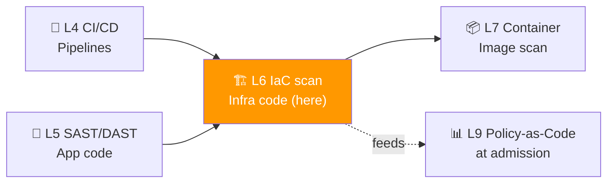
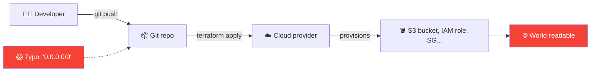
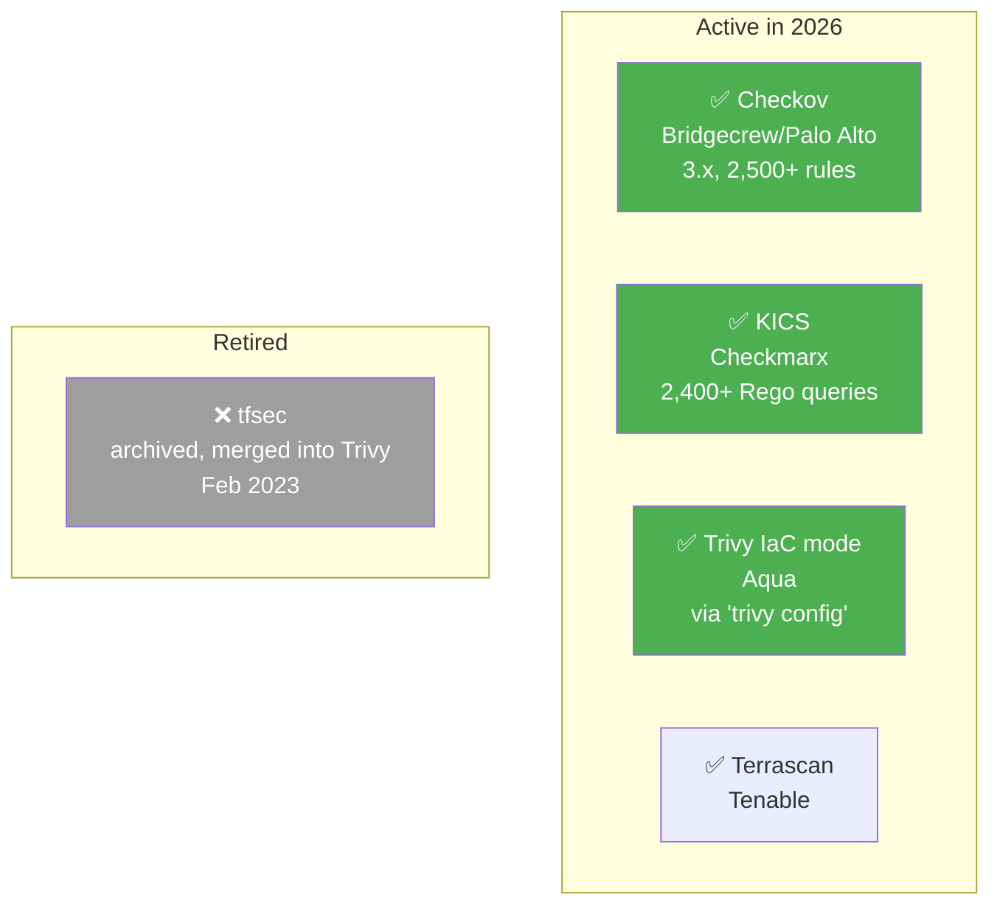
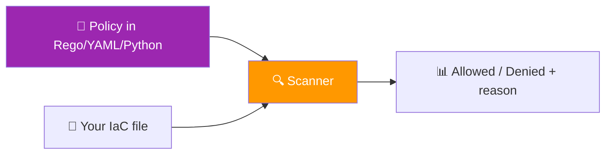

# 📌 Lecture 6 — Infrastructure-as-Code Security: Scanning Your Cloud Before It Burns

---

## 📍 Slide 1 – ☁️ The S3 Bucket That Cost $190M

* 🗓️ **July 19, 2019** — a former AWS employee uses a misconfigured WAF rule in Capital One's infrastructure to mount an **SSRF** attack against the EC2 metadata service
* 🎫 The IAM role attached to the WAF has wildcard `s3:Get*` and `s3:List*` permissions across **700+ buckets**
* 💾 Attacker exfiltrates **106 million records** — names, addresses, credit scores, 140,000 Social Security numbers
* 💰 Settlement + remediation: **~$190 million**
* 🧠 The vulnerable WAF, the over-privileged IAM role, and the exposed metadata endpoint were all **declared in Terraform** — and never scanned
* 🪜 By 2020 Capital One had Checkov in their pipeline. Two years and $190M too late

> 🤔 **Think:** Lecture 5 covered SAST scanning your *application code*. What scans your *infrastructure code* before `terraform apply` lights it on fire?

---

## 📍 Slide 2 – 🎯 Learning Outcomes

| # | 🎓 Outcome |
|---|-----------|
| 1 | ✅ Define Infrastructure-as-Code and explain why it created a new class of vulnerability |
| 2 | ✅ Recognize the top IaC misconfiguration categories (CIS / NIST mapping) |
| 3 | ✅ Run **Checkov** against Terraform + Pulumi and read its JSON output |
| 4 | ✅ Run **KICS** against an Ansible playbook and triage the Rego-based findings |
| 5 | ✅ Explain why **tfsec** was retired and where IaC scanning lives in Trivy today |
| 6 | ✅ Write a **custom Checkov policy** in YAML for a project-specific rule |

---

## 📍 Slide 3 – 🗺️ Where Lecture 6 Sits



* 🔁 **Building on L4 (CI/CD):** IaC scanning runs as a pipeline stage — same gates, new file types
* 🔁 **Building on L5 (SAST):** same idea (analyze static text), but the *language* is HCL/YAML/Python-Pulumi and the *bugs* are misconfigurations, not memory corruption
* 🛣️ **Setting up L9:** Conftest/Rego in Lecture 9 reuses the policy-as-code idea you meet here

---

## 📍 Slide 4 – 📜 What Is Infrastructure-as-Code?

> 💬 *"Treat infrastructure the same way you treat application code: version it, test it, review it, deploy it from a pipeline."* — Kief Morris, *Infrastructure as Code* (O'Reilly, 2nd ed., 2020)

| 🏷️ Tool | 📝 Language | 🎯 Model | 🗓️ Origin |
|---|---|---|---|
| 🟦 **Terraform / OpenTofu** | HCL | Declarative, state-driven | HashiCorp 2014; OpenTofu fork **September 2023** |
| 🟪 **Pulumi** | Python/TS/Go/.NET | Declarative via real code | Joe Duffy + team, **2017** |
| 🔴 **Ansible** | YAML | Imperative push (SSH) | Michael DeHaan, **2012**, acquired by Red Hat 2015 |
| ☁️ **CloudFormation** | YAML/JSON | AWS-native declarative | AWS, **2011** |
| ☸️ **Helm** | Templated YAML | K8s package manager | 2016 (Deis); CNCF Graduated **2020** |

* 🪜 All five are static text files. **Every one of them can be scanned before it ships.**

---

## 📍 Slide 5 – 🧨 Why IaC Creates a New Bug Class



* ⚡ Mistakes that used to be **one engineer × one resource** are now **one git push × N replicas**
* 🧠 IBM's 2024 *Cost of a Data Breach* report attributes **~45%** of cloud breaches to misconfiguration — more than any other root cause
* 🎯 **The whole point of IaC scanning:** catch the typo before `terraform apply` does it to 200 buckets

> 🤔 **Think:** Lecture 5's SAST checks *application code*. IaC scanning checks *infrastructure code*. Same shift-left philosophy; different file type.

---

## 📍 Slide 6 – 🔥 The Misconfiguration Top Hits

These are the categories every scanner ships rules for. Memorize them — they make the news.

| 🚨 Category | 💥 Typical mistake | 🛡️ Mitigation |
|---|---|---|
| 🌐 Public network exposure | `cidr_blocks = ["0.0.0.0/0"]` on SSH/RDP | Restrict CIDR or use bastion/SSM |
| 🔑 Hard-coded secrets | `password = "admin123"` in HCL | Vault / cloud secret manager (links to L3) |
| 🪣 Public storage | S3 bucket without `block_public_access` | Default-deny ACL + bucket policy |
| 🧓 Over-privileged IAM | `"Action": "*"` / `"Resource": "*"` | Least privilege + permission boundaries |
| 🔓 Unencrypted at rest | EBS/RDS/S3 without `encryption = true` | Encrypt-by-default + customer-managed keys |
| 📜 No logging | CloudTrail/VPC flow logs disabled | Centralized log destination + retention SLA |
| 🌍 Cross-account trust | `Principal = "*"` in resource policy | Specific account IDs only |
| 🗝️ Old TLS | `min_tls_version = "1.0"` | TLS 1.2+ enforced |

* 📚 These map directly to the **CIS Benchmarks** (Center for Internet Security) and **NIST 800-53** controls; every scanner ships them as rule IDs like `CKV_AWS_19`

---

## 📍 Slide 7 – 🛠️ The Scanner Field Today



* 🪦 **tfsec is dead.** Aqua consolidated tfsec into Trivy in **February 2023**. Last release v1.28.14 was a dependency-CVE fix only. New scans go through `trivy config <path>` — same rule heritage, broader format coverage
* 🎯 This course pins **Checkov 3.x** for Task 1 (Terraform + Pulumi) and **KICS** for Task 2 (Ansible) — both free, OSS, and represent the two dominant rule-language families

---

## 📍 Slide 8 – 🐍 Checkov in 5 Minutes

* 🏢 Built by **Bridgecrew** (acquired by **Palo Alto Networks**, March 2021); open-sourced 2019
* 🐍 Written in Python (`pip install checkov`); ships rules in YAML + Python
* 🔢 Latest major: **Checkov 3.x** (2026) — **2,500+ built-in policies**, 800+ graph-based checks
* 📂 Scans: Terraform, OpenTofu, CloudFormation, Kubernetes, Helm, Dockerfile, GitHub Actions, ARM, Bicep, OpenAPI, Pulumi, Ansible (basic)

```bash
# Quick start used in the lab
pip install checkov
checkov -d ./terraform/ --output cli --output json --output-file-path results
```

| 📐 Output | 🎯 Meaning |
|---|---|
| `--output cli` | Human-readable, colored summary |
| `--output json` | Machine-readable, importable to DefectDojo (L10) |
| `--output sarif` | GitHub Code Scanning format |
| `--skip-check CKV_AWS_19` | Skip a rule (justify in PR description) |

* 🧠 Each finding ships with **fix guidance** — Checkov is one of the few scanners that points you at a remediation line, not just a problem

---

## 📍 Slide 9 – 🧱 A Checkov Finding Read Aloud

```
Check: CKV_AWS_18: "Ensure the S3 bucket has access logging enabled"
        FAILED for resource: aws_s3_bucket.user_uploads
        File: /modules/storage/main.tf:14-22
        Guide: https://docs.bridgecrew.io/docs/s3_13-enable-logging
```

| 🏷️ Element | 🎯 Meaning |
|---|---|
| `CKV_AWS_18` | Stable rule ID — use it for suppress lists |
| FAILED | One of `PASSED` / `FAILED` / `SKIPPED` |
| Resource | The HCL block that triggered |
| File + line | Exact remediation location |
| Guide | Bridgecrew's narrative explanation |

* 🧠 Critical reading skill: when reviewing a Checkov report, sort by **rule ID frequency** first — one missing default in a module replicates as 30 findings; fix the module, fix all 30

---

## 📍 Slide 10 – 🌐 KICS for Multi-Language Estates

* 🏢 Built by **Checkmarx**, open-sourced **November 2020**; written in Go
* 📜 Rules in **Rego** (same language as OPA — directly relevant to Lecture 9)
* 🔢 Latest stable: 2.x (last release **March 2025**) — **2,400+ Rego queries**
* 🌍 Scans: Terraform, K8s, Ansible, Docker/Compose, CloudFormation, OpenAPI, Helm, Bicep, **Pulumi**, Crossplane, GitHub Workflows, gRPC

```bash
# Used for Task 2 (Ansible) in the lab
docker run -v "$PWD:/path" checkmarx/kics:latest \
  scan -p /path/ansible/ -o /path/results --report-formats json,sarif
```

* 🆚 **Checkov vs KICS — when to use which?**
  * Checkov has **deeper Terraform-specific** checks (graph relationships across resources)
  * KICS has **wider language coverage** (Ansible, Helm templates, OpenAPI) and a **uniform Rego rule format** — easier to write a custom rule once it works for one input type

---

## 📍 Slide 11 – 📜 Policy-as-Code: A First Look



* 💡 **Policy-as-Code** = your security rules live in version control, are reviewed in PRs, and execute deterministically in CI
* 🪜 Both Checkov and KICS implement this; the **same idea** powers Conftest (Lecture 9) and Gatekeeper (admission control)
* 🎁 **Bonus task** in Lab 6 asks you to write a Checkov **custom policy** — your first Policy-as-Code rule
* ✋ This lecture introduces PaC for IaC; Lecture 9 expands it to runtime admission control. Don't try to do both in your head

---

## 📍 Slide 12 – ✍️ A Custom Checkov Policy in YAML

```yaml
metadata:
  id: "CKV2_CUSTOM_1"
  name: "Ensure S3 buckets have lifecycle policy"
  category: "BACKUP_AND_RECOVERY"
  severity: "MEDIUM"
definition:
  and:
    - cond_type: "filter"
      attribute: "resource_type"
      value: ["aws_s3_bucket"]
      operator: "within"
    - cond_type: "connection"
      resource_types: ["aws_s3_bucket_lifecycle_configuration"]
      connected_resource_types: ["aws_s3_bucket"]
      operator: "exists"
```

| 🧩 Section | 🎯 What it does |
|---|---|
| `metadata.id` | `CKV2_*` prefix for graph (cross-resource) rules; `CKV_*` for single-resource |
| `category` | Used for Checkov's default policy groups |
| `definition.and` | All conditions must hold; supports `or`, `not` |
| `cond_type: connection` | "Is this resource referenced by another?" — the graph engine |

* 🧠 This is exactly the bonus task in the lab. Read it twice; we'll write one together in office hours

---

## 📍 Slide 13 – 🤖 Wiring Scanners Into CI (Building on L4)

```yaml
# .github/workflows/iac-scan.yml — extends what you built in L4
name: IaC Scan
on: [pull_request]
jobs:
  checkov:
    runs-on: ubuntu-latest
    steps:
      - uses: actions/checkout@b4ffde6...
      - uses: bridgecrewio/checkov-action@v12      # pin to digest in real life
        with:
          directory: terraform/
          framework: terraform
          output_format: sarif
          output_file_path: results/
      - uses: github/codeql-action/upload-sarif@v3
        with:
          sarif_file: results/results.sarif
```

* 🪜 **Three layers, same pipeline:**
  1. PR scan (this job) — **fail the PR** on HIGH+
  2. Nightly full scan on `main` — catches new rules added to the scanner
  3. Drift detection (Lecture 9 covers this) — compares declared state to actual cloud
* 🧠 **`continue-on-error: true` is a smell.** Recall from Lecture 4: if you can't fail the build, you're not gating — you're decorating

---

## 📍 Slide 14 – 🐍 Where Pulumi Differs

* 📐 Pulumi programs are **real code** (Python/TS/Go/.NET) that *emits* a declarative state graph
* 🧪 Static analyzers can scan two layers:
  1. The **source code** (looks like normal Python — SAST tools see it as Python)
  2. The **rendered state** (`pulumi preview --json`) — what will actually be created
* 🎯 **Checkov scans the rendered state** (`pulumi preview` JSON), not your TypeScript directly — which is exactly right, because IaC misconfigs live in the resource graph, not the loop that built it

> 💬 *"Pulumi's superpower is that you write infrastructure in your favorite language. Pulumi's superpower is also that you can write a `for` loop that provisions 500 buckets."* — paraphrasing the Pulumi team at KubeCon 2023

---

## 📍 Slide 15 – 🔬 Case Study: Tesla's Exposed Kubernetes Dashboard (2018)

* 🗓️ **February 20, 2018** — RedLock researchers find a **Kubernetes admin console** on Tesla's AWS, **internet-exposed**, **no authentication**
* 🪙 Attackers had been using it to mine Monero, dialing CPU to stay under radar
* 🔍 Root cause: Terraform module spun up the EKS cluster with `endpoint_public_access = true` and **no IAM auth configuration**
* 🛡️ A Checkov scan (rule `CKV_AWS_38` or equivalent today) would have flagged the public endpoint
* 🧠 Tesla's response was fast — the deeper lesson is **how easy this is to ship**. Every EKS module's first version since 2018 has defaulted to private; the rule exists because the default *wasn't* private

---

## 📍 Slide 16 – 🔬 Case Study: Imperva (2019)

* 🗓️ **October 2019** — Imperva discloses a 2018 breach traced to a **misconfigured snapshot**
* 🧪 A pre-prod database snapshot is created with an embedded AWS API key
* 🪣 The snapshot's S3 bucket lacked default-deny ACL; attacker enumerates and exfiltrates **customer email + hashed passwords**
* 🪜 Two IaC rules would have caught this:
  * `CKV_AWS_18` (S3 logging) — would have shown the access
  * `CKV_AWS_56` (S3 public access block) — would have prevented the access
* 💭 Imperva is a security company. **No one is immune to misconfiguration.** This is precisely why the scanner runs in CI, not in someone's head

---

## 📍 Slide 17 – 🧮 Triage: 1,000 Findings on Day One

The first scan of a real codebase will find hundreds of issues. A program rule of thumb (matches Lecture 5's SAST triage):

| 🪜 Phase | 🎯 What you do | 📅 Timeline |
|---|---|---|
| 0️⃣ Baseline | Scan, count by severity, **don't fix yet** | Day 1 |
| 1️⃣ Triage | Sort by rule ID frequency; group by module | Week 1 |
| 2️⃣ Module fixes | Fix the top 5 modules → kills 60-80% of findings | Weeks 2-3 |
| 3️⃣ Gate | Add Checkov to PR; **fail on HIGH+ new** findings only | Week 4 |
| 4️⃣ Burndown | Suppress existing findings with explicit expiry; track in DefectDojo (L10) | Ongoing |

* 🎯 **Don't try to fix everything in week one.** A blocked CI on day 2 makes the security team an obstacle, not a partner
* 🪜 The **gate-on-new** pattern (also called "diff scanning" or "delta gating") is how mature programs avoid bankruptcy. Same discipline you saw in SAST (Lecture 5)

---

## 📍 Slide 18 – 🪜 Sharing IaC Across Teams: Modules + Policy

* 📦 **Module ownership pattern:** platform team ships hardened modules (e.g. `s3_secure`) that wrap raw providers with safe defaults; application teams consume modules, not raw resources
* 🛡️ **Pre-commit hook (extending L3):** run `checkov -d . --quiet` before commit; same scanner, earlier
* 🧪 **Drift detection** is the topic of L9 — a scanner only checks what you *declared*; cloud changes can still happen out-of-band (root console, mythical Tuesday 4pm hotfix)

> 🤔 **Think:** A scanner can prove your IaC is safe. Can a scanner prove your **cloud** is safe? (Trick: only if it also reads live cloud state — which Trivy, Checkov, and Prowler now do, but with different trade-offs.)

---

## 📍 Slide 19 – ⏭️ What's Next + Lab Preview

* 🧪 **Lab 6** (this week):
  * Task 1 (6 pts): Checkov on a Terraform + Pulumi sample with planted misconfigs
  * Task 2 (4 pts): KICS on an Ansible playbook; compare ruleset coverage to Checkov
  * Bonus (2 pts): Write a **custom Checkov policy** — your first PaC rule
* 🚀 **Lecture 7** (next week): **Container & Kubernetes Security** — Trivy on the Juice Shop image, Pod Security Standards, baseline K8s hardening. The next layer of the stack
* 🪜 You're now scanning code (L5), infra (L6); next we scan the artifact itself

---

## 📍 Slide 20 – 📚 Resources & Takeaways

**Books:**

| 📖 Book | ✍️ Why |
|---|---|
| *Terraform: Up & Running* — Yevgeniy Brikman (O'Reilly, 3rd ed. 2022) | Ch. 10 *"Production-Grade Terraform Code"* covers module testing + policy |
| *Infrastructure as Code* — Kief Morris (O'Reilly, 2nd ed. 2020) | Ch. 7 *"Configuration Registries"* + ch. 11 *"Testing Infrastructure"* — broad framing |
| *Securing DevOps* — Julien Vehent (Manning, 2018) | Ch. 3 *"Hardening AWS"* maps cloud misconfigs to specific scanner rules |
| *Pulumi: Continuous Deployment in the Cloud* — Will Boyd (Pulumi, free e-book) | Best free intro to scanning Pulumi state graphs |

**Talks & specs:**

* 🎥 *"Securing Infrastructure as Code"* — Barak Schoster (Bridgecrew/Checkov), Black Hat 2020
* 🎥 *"From tfsec to Trivy: Consolidating IaC Scanning"* — Aqua team, KubeCon NA 2023
* 📜 [CIS Benchmarks](https://www.cisecurity.org/cis-benchmarks/) — the source of most rules
* 📜 [Checkov rule index](https://www.checkov.io/5.Policy%20Index/terraform.html) — every `CKV_AWS_*` with description
* 📜 [KICS query catalogue](https://docs.kics.io/latest/queries/all-queries/) — all 2,400+ Rego queries

**Takeaways:**

| # | 🧠 Insight |
|---|---|
| 1 | IaC turned single-host typos into 200-replica disasters. Scanning is the cheapest insurance. |
| 2 | Misconfiguration is the leading cloud breach cause — and the most automatable to prevent. |
| 3 | Use Checkov for Terraform-heavy estates; KICS for multi-language. Trivy now covers the tfsec heritage. |
| 4 | Fix at the module level, not at the resource level — one bug fix can close 30 findings. |
| 5 | Day-one full scan is a learning exercise. **Gate on new** is the operational pattern. |
| 6 | Custom policies turn your team's tribal knowledge into a CI-enforced rule. Write the bonus-task policy seriously — it's how programs scale. |

> 💬 *"The cloud is just someone else's computer — and now you're declaring it as text. Read your declarations before AWS does."* — paraphrased from too many KubeCon hallway tracks to count
