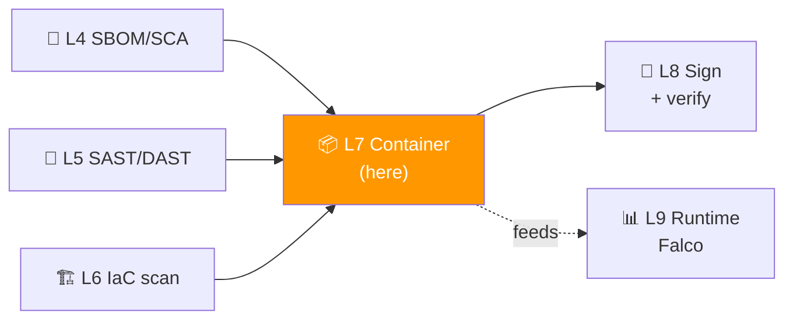
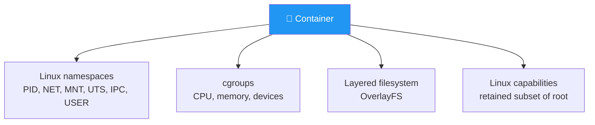
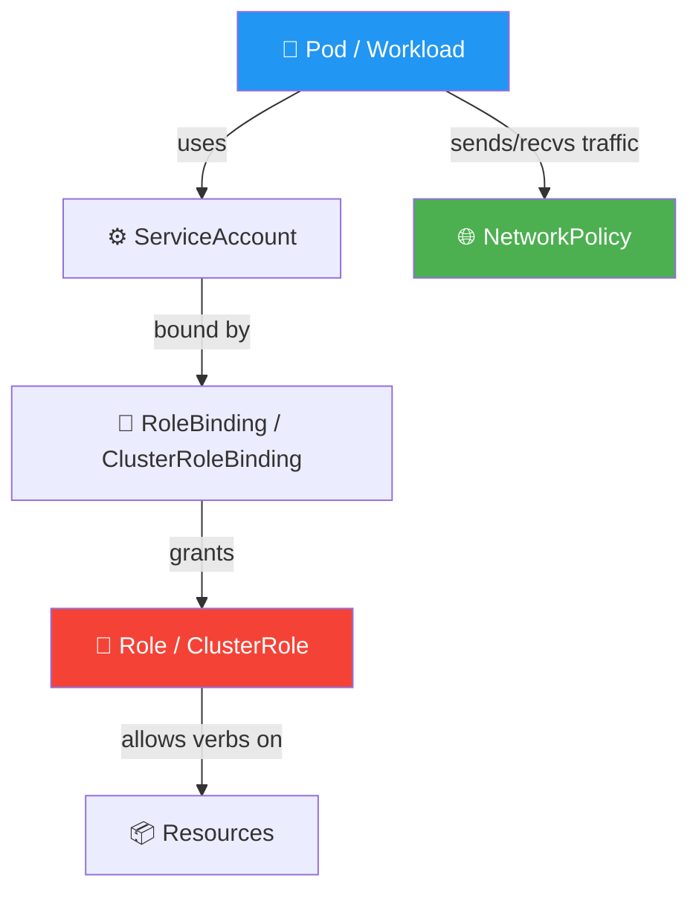
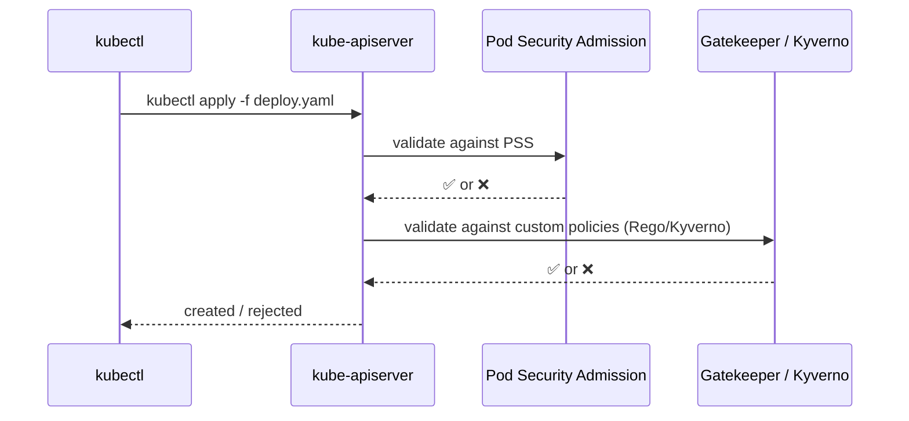

# 📌 Lecture 7 — Container & Kubernetes Security: Scanning the Artifact, Hardening the Cluster

---

## 📍 Slide 1 – 🪅 The 1.6 Million Cryptominer Containers

* 🗓️ **August 2018 onward** — Aqua Security's research team begins tracking misconfigured Docker daemons and exposed Kubernetes API servers
* 🪙 By 2023 they had documented **>1.6 million** publicly accessible containers running cryptominers; the average compromise lifecycle: **15 minutes from misconfig to miner**
* 🎯 The pattern: a developer exposes `2375/tcp` on a cloud VM "just for debugging", or a fresh K8s cluster ships with `kubectl proxy` reachable; scanner bots find it in minutes; miners deploy by the thousand
* 🧠 Every one of these is a **misconfiguration finding** that Trivy + a Pod Security Standard policy would have flagged — the rules existed; they weren't gating

> 🤔 **Think:** Lecture 6 scanned the IaC text that *creates* the cluster. This lecture scans the *image* you run inside it and the *cluster config* it lives in. Three layers of static checks before any code runs.

---

## 📍 Slide 2 – 🎯 Learning Outcomes

| # | 🎓 Outcome |
|---|-----------|
| 1 | ✅ Write a **secure Dockerfile** (non-root, minimal base, no embedded secrets) |
| 2 | ✅ Run **Trivy** image scan and read its CVE + misconfig output |
| 3 | ✅ Apply **Pod Security Standards** (Privileged / Baseline / Restricted) to a namespace |
| 4 | ✅ Choose between distroless, Alpine, and full-distro base images by use case |
| 5 | ✅ Identify the three Kubernetes objects that most often grant excessive privilege (Role/ClusterRole, ServiceAccount, NetworkPolicy gaps) |

---

## 📍 Slide 3 – 🗺️ Where Lecture 7 Sits



* 🪜 **Building on prior labs:**
  * L4 generated the SBOM — we'll scan its CVEs here
  * L6 scanned the IaC that creates clusters — we now scan the **images** running inside them
* 🎯 **Lab 7 alignment:** Task 1 (Trivy image scan on Juice Shop + Docker Bench), Task 2 (K8s hardening via PSS), Bonus (small Policy-as-Code gate for insecure pods)
* 🛣️ **Setting up L8:** the image we harden here will be signed in Lab 8; runtime behavior monitored in Lab 9

---

## 📍 Slide 4 – 🐳 What's Actually in a Container

> 💬 *"A container is just a Linux process with a particularly fancy set of namespaces and cgroups."* — Liz Rice, *Container Security* (O'Reilly, 2020)



* 🪜 A container is **not** a VM. It shares the kernel with the host. **Kernel CVE = container escape risk** (see Dirty Pipe CVE-2022-0847, runc CVE-2024-21626)
* 🧠 The image is just a **tarball of filesystem layers**. Scanning the image = scanning those layer tarballs for known-CVE packages + secrets + misconfig
* 🪜 **Pictographic mental model:** image = recipe; container = cooked meal; runtime = stove. Each has different vulnerabilities

---

## 📍 Slide 5 – 🔥 Where Container Bugs Come From

| 🚨 Class | 💥 Example | 🪜 Layer to fix |
|---|---|---|
| **Vulnerable base image** | Alpine with patched glibc CVE | Update / rebuild |
| **Vulnerable app deps** | Log4j 2 in your Java image (Lecture 1) | SBOM + SCA (L4) |
| **Embedded secrets** | Build arg `ARG DB_PASSWORD=...` baked into a layer | gitleaks + Trivy secrets |
| **Excessive privileges** | `USER root`, no `--cap-drop` | Dockerfile + runtime flags |
| **Insecure runtime** | `--privileged`, host PID, host network | K8s SecurityContext / PSS |
| **Kernel CVE** | runc/containerd escape | OS patch cadence |

* 🪜 Most of these layers are **scannable** — Trivy hits all of them in one pass
* 🧠 **The runtime classes (privileged, host PID)** are NOT scannable on the image — they live in your **K8s manifest** or `docker run` flags. That's where Lab 7 Task 2 lives

---

## 📍 Slide 6 – 🪜 Dockerfile: The Six Rules

```dockerfile
# ✅ Hardened Dockerfile
FROM node:22-alpine AS build                  # 1. Pinned, minimal base
WORKDIR /app
COPY package*.json ./
RUN npm ci --omit=dev

FROM gcr.io/distroless/nodejs22-debian12      # 2. Distroless runtime
WORKDIR /app
COPY --from=build /app .
COPY src/ ./src/
USER 65532                                    # 3. Non-root user (nobody)
ENV NODE_ENV=production                       # 4. No debug paths
EXPOSE 3000                                   # 5. Explicit ports only
HEALTHCHECK CMD ["node", "src/healthcheck.js"] # 6. Built-in healthcheck
ENTRYPOINT ["/nodejs/bin/node", "src/server.js"]
```

| # | 🪜 Rule | 🎯 Why |
|---|---|---|
| 1 | Pin base by tag (or digest for max safety) | Same as L4 action pinning — immutability |
| 2 | Use multi-stage + distroless or `-alpine` | Smaller attack surface; no shell to drop into |
| 3 | `USER` non-root (numeric UID best for K8s) | runAsNonRoot policy compliance |
| 4 | No build args for secrets | Embedded in image history; scrape-able with `docker history` |
| 5 | Explicit EXPOSE — even if K8s doesn't read it | Documentation + IDE hints |
| 6 | Built-in healthcheck | K8s readiness/liveness probes have something honest to call |

* 🧠 Trivy's `--config` (misconfig) mode reads your Dockerfile and flags violations of these rules — you'll see this in Lab 7 Task 1

---

## 📍 Slide 7 – 🪶 Distroless, Alpine, or Ubuntu?

| 🏷️ Base | 🪶 Size | 🔍 Shell | 🪜 Use when |
|---|---|---|---|
| `ubuntu:24.04` | ~80MB | `bash` | Legacy apps, debugging tools needed |
| `node:22-alpine` | ~50MB | `sh` (busybox) | Default for most apps; small CVE surface |
| `gcr.io/distroless/nodejs22` | ~30MB | None | Production; no debug interaction needed |
| `cgr.dev/chainguard/node` (Chainguard, paid) | ~25MB | None | Production with signed-by-default images |

* 🪜 **Distroless was Google's 2018 contribution** — base images with only your runtime + dependencies. No shell = no `nsenter` from a compromised process; no package manager = no `apk add` exfiltration
* 🚨 The cost: **you can't `kubectl exec -it -- sh`**. Debugging needs `kubectl debug` (k8s 1.23+) with an ephemeral container
* 🧠 The right choice depends on operational maturity. **For this course:** distroless or alpine. Avoid `latest` of anything

---

## 📍 Slide 8 – 🔎 Trivy: One Scanner, Six Targets

* 🏢 By **Aqua Security**; first release **2019**; Go binary, single statically-linked tool
* 🔢 Latest: **Trivy v0.69.x** (April 2026)
* 🎯 Six targets Trivy scans:
  1. **Image** (`trivy image ...`) — CVEs + misconfig + secrets in container images
  2. **Filesystem** (`trivy fs ...`) — local directories
  3. **Repository** (`trivy repo ...`) — Git repos for misconfig + secrets
  4. **Kubernetes** (`trivy k8s ...`) — live cluster scan; uses RBAC to enumerate workloads
  5. **AWS / Azure / GCP** (`trivy aws ...`) — live cloud config scan
  6. **SBOM** (`trivy sbom ...`) — scan an existing CycloneDX/SPDX for CVEs

```bash
# Lab 7 starts here
trivy image bkimminich/juice-shop:v19.0.0 \
  --severity HIGH,CRITICAL \
  --format json --output juice-shop-scan.json
```

* 🧠 Same Trivy that absorbed tfsec (L6). Same Trivy that consumes the SBOM from L4. **One tool, integrated outputs.**

---

## 📍 Slide 9 – 🧱 Reading a Trivy Report

```
juice-shop (alpine 3.18.4)
==========================
Total: 23 (HIGH: 18, CRITICAL: 5)

┌──────────────────┬───────────────┬──────────┬─────────────┬───────────────┐
│ Library          │ Vulnerability │ Severity │ Installed   │ Fixed Version │
├──────────────────┼───────────────┼──────────┼─────────────┼───────────────┤
│ libcrypto3       │ CVE-2023-5363 │ HIGH     │ 3.1.4-r0    │ 3.1.4-r1      │
│ libssl3          │ CVE-2023-5363 │ HIGH     │ 3.1.4-r0    │ 3.1.4-r1      │
│ openssl          │ CVE-2024-0727 │ CRITICAL │ 3.1.4-r0    │ 3.1.4-r4      │
│ glib             │ CVE-2024-34397│ HIGH     │ 2.76.6-r0   │ 2.76.6-r1     │
└──────────────────┴───────────────┴──────────┴─────────────┴───────────────┘
```

| 🏷️ Column | 🎯 Meaning |
|---|---|
| Library | Package as found in image (deb/apk/rpm/jar/npm/...) |
| Vulnerability | CVE ID — track in NVD or CIRCL |
| Severity | NVD CVSS-based, also reflected in vendor advisories |
| **Fixed Version** | If non-empty → a fix exists; not bumping is a choice |

* 🪜 **The triage shortcut:** sort by *Fixed Version is not empty AND severity ≥ HIGH*. That's your weekly remediation queue
* 🧠 **CVEs with no fix yet** still matter for risk acceptance — but they're a different conversation (Lecture 10)

---

## 📍 Slide 10 – 🪜 The Kubernetes Object Trinity for Security



* 🪪 **RBAC** = Role-Based Access Control. The right model for cluster authz since K8s 1.6 (2017)
* 🚨 **Three common excessive-privilege patterns:**
  1. **Wildcard ClusterRoles** — `verbs: ["*"]`, `resources: ["*"]` ≡ root-of-cluster
  2. **Default ServiceAccount used by app pods** — every pod can talk to the K8s API
  3. **No NetworkPolicy** — every pod can connect to every other pod (the "flat network" failure mode)

* 🪜 In Lab 7 Task 2 you'll harden a manifest against all three

---

## 📍 Slide 11 – 🛡️ Pod Security Standards (PSS)

* 🏛️ **PodSecurityPolicy (PSP)** — first K8s admission control, **deprecated in 1.21, removed in 1.25**. Replaced by:
* 🏛️ **Pod Security Admission (PSA)** + **Pod Security Standards (PSS)** — stable in **K8s 1.25 (August 2022)**

| 🎚️ Level | 🚦 Allows | 🪜 Use for |
|---|---|---|
| `privileged` | Everything (host PID, host network, all capabilities) | Sysadmin/CNI namespaces only |
| `baseline` | No host namespaces, no `runAsRoot`, drops dangerous capabilities | App workloads (default) |
| `restricted` | Full hardening: read-only root FS, capabilities ALL dropped, runAsNonRoot enforced | Production app workloads |

* 🪜 **Apply by namespace label:**

```yaml
apiVersion: v1
kind: Namespace
metadata:
  name: juice-shop
  labels:
    pod-security.kubernetes.io/enforce: restricted
    pod-security.kubernetes.io/warn: restricted
    pod-security.kubernetes.io/audit: restricted
```

* 🧠 `enforce` blocks creation; `warn` logs to kubectl; `audit` logs to audit log. **In dev, start with `warn`; in prod, escalate to `enforce`**

---

## 📍 Slide 12 – 🛠️ securityContext: The Per-Pod Hardening

```yaml
apiVersion: apps/v1
kind: Deployment
spec:
  template:
    spec:
      automountServiceAccountToken: false      # 🚦 Default-deny K8s API
      securityContext:
        runAsNonRoot: true                     # 🚦 Enforced by PSS restricted
        runAsUser: 65532
        fsGroup: 65532
        seccompProfile:
          type: RuntimeDefault                 # 🚦 Block dangerous syscalls
      containers:
        - name: app
          image: ghcr.io/me/juice-shop@sha256:...
          imagePullPolicy: IfNotPresent
          securityContext:
            allowPrivilegeEscalation: false    # 🚦 No setuid binaries
            readOnlyRootFilesystem: true       # 🚦 Tampering protection
            capabilities:
              drop: ["ALL"]                    # 🚦 Drop every Linux capability
          resources:
            limits: { memory: "256Mi", cpu: "200m" }   # 🚦 DoS protection
            requests: { memory: "128Mi", cpu: "50m" }
```

* 🪜 **Every line here is a Trivy misconfig rule.** Run `trivy k8s` against your cluster; missing items show up as findings
* 🧠 `readOnlyRootFilesystem: true` is the single most effective runtime hardening — and the one most often skipped because apps write temp files. Use `emptyDir` volumes for those

---

## 📍 Slide 13 – 🔬 Case Study: Docker Hub 2019

* 🗓️ **April 25, 2019** — Docker discloses unauthorized access to a database holding **190,000 accounts** with hashed passwords, GitHub/Bitbucket tokens, and Docker registry tokens
* 🧠 The breach wasn't a container escape — it was **Docker Hub's own infrastructure** breached via API. But the impact propagated through every customer
* 🪜 **DevSecOps lessons:**
  * 🪪 Rotate registry tokens regularly (the long-lived-token failure mode again, from Lecture 4)
  * 🔏 Pin and sign images (Lab 8) — even if the registry is compromised, verified signatures help
  * 🛡️ Image scanning catches *only* known CVEs; registry compromises need orthogonal controls

> 💬 *"Container security is application security, plus host security, plus orchestrator security, plus registry security."* — Liz Rice paraphrased; container security is **not a layer**, it's an intersection

---

## 📍 Slide 14 – 🔬 Case Study: runc CVE-2024-21626 ("Leaky Vessels")

* 🗓️ **January 31, 2024** — Snyk discloses CVE-2024-21626 in runc: a working-directory race condition lets a malicious image **escape its container** to the host filesystem
* 🌍 runc powers Docker, containerd, Kubernetes, Podman — essentially every container runtime
* 🛡️ **What protected secure deployments:**
  * 🛠️ Patched runc within hours of release (operational discipline)
  * 🪜 **Read-only root filesystem** on the container — limits the attacker's write scope after escape
  * 🐝 **Runtime detection** (Falco, Lab 9) — flags the unusual chdir + filesystem activity
* 🧠 **The takeaway:** even with perfect image hygiene, runtime CVEs happen. Defense in depth at the **runtime + kernel** layers (L9) is non-negotiable

---

## 📍 Slide 15 – 🌐 NetworkPolicy: The "Flat Network" Cure

* 🪜 By default in K8s, **every pod can reach every other pod**. This is the "flat network" failure mode
* 🎯 **NetworkPolicy** lets you write firewall-style rules at the pod label level (works with most CNIs: Calico, Cilium, Antrea, Weave)

```yaml
apiVersion: networking.k8s.io/v1
kind: NetworkPolicy
metadata:
  name: juice-shop-default-deny
  namespace: juice-shop
spec:
  podSelector: {}                # all pods
  policyTypes: [Ingress, Egress]
  egress:
    - to:
        - namespaceSelector:
            matchLabels: { name: monitoring }   # allow → monitoring NS only
```

* 🪜 **Pattern that scales:** **default-deny** at the namespace level + explicit allows. Same philosophy as IAM (L6) — default-deny + targeted-allow
* 🧠 Lab 7 Task 2 includes adding NetworkPolicy; Conftest (introduced in this lecture as bonus, deep in L9) can gate that every new pod is covered by at least one policy

---

## 📍 Slide 16 – 🚦 Admission Control: The Gate Before Apply



| 🛠️ Admission control | 🎯 What it does | 🪜 Stage |
|---|---|---|
| **Pod Security Admission** | Built-in; enforces PSS levels | K8s 1.25+ |
| **Gatekeeper (OPA)** | Rego policies as CRDs | Custom rules |
| **Kyverno** | YAML policies as CRDs (no DSL learning) | Custom rules |

* 🪜 **Gatekeeper uses Rego — same language as Conftest (L9) and KICS (L6).** Skills compound across the program
* 🪜 **In Lab 7 Bonus** you'll preview Conftest as a CI-side gate (before apply), then Lab 9 covers full runtime admission

---

## 📍 Slide 17 – 🪜 Common Mistakes & Fixes

| 🚨 Mistake | 🛠️ Fix |
|---|---|
| `FROM node:latest` (or `:18`, but no minor pin) | Pin to specific tag (e.g. `node:22.10.0-alpine3.20`); update via Renovate/Dependabot |
| `USER root` (or no USER line) | `USER 65532` (numeric — K8s `runAsNonRoot` reads numeric only) |
| Embedded secrets via `ARG`/`ENV` | Use external secret mount; never bake into image |
| `default` ServiceAccount used by app pods | Create a dedicated SA per workload; `automountServiceAccountToken: false` unless needed |
| `privileged: true` "just to make it work" | Diagnose what specific capability is needed; use `capabilities.add: [NET_BIND_SERVICE]` (or whatever) instead |
| `image: myapp:latest` in K8s | Pin by digest `@sha256:...` — same lesson as L4 GHA pinning |

* 🧠 Almost every container-security audit report ends with these six items. Get them right and you're ahead of 80% of orgs

---

## 📍 Slide 18 – 🪜 Putting It Together in CI

```yaml
# .github/workflows/container-sec.yml (extends L4 + L5 + L6 patterns)
jobs:
  build-and-scan:
    runs-on: ubuntu-latest
    permissions:
      contents: read
      id-token: write       # for OIDC if signing happens here (L8 preview)
      packages: write
    steps:
      - uses: actions/checkout@b4ffde6...
      - name: Build image
        run: docker build -t ghcr.io/${{ github.repository }}:${{ github.sha }} .
      - name: Scan image (Trivy)
        uses: aquasecurity/trivy-action@v0.28.0
        with:
          image-ref: ghcr.io/${{ github.repository }}:${{ github.sha }}
          severity: HIGH,CRITICAL
          exit-code: 1        # fail PR on findings
          format: sarif
          output: trivy.sarif
      - uses: github/codeql-action/upload-sarif@v3
        with: { sarif_file: trivy.sarif }
      # K8s manifest scan
      - name: Scan manifests (Trivy config)
        run: trivy config ./k8s/ --severity HIGH,CRITICAL --exit-code 1
```

* 🪜 **The L4 lessons all apply:** pin by SHA, OIDC, least-privilege `permissions:`. The new part is the Trivy step
* 🧠 Note: separate **image scan** (CVEs) and **manifest scan** (misconfig) — different output classes, both gated

---

## 📍 Slide 19 – ⏭️ What's Next + Lab Preview

* 🧪 **Lab 7** (this week):
  * Task 1 (6 pts): Trivy image scan + Docker Bench on Juice Shop image; analyze CVE + misconfig findings
  * Task 2 (4 pts): Harden a K8s deployment with PSS (`restricted`) + securityContext + NetworkPolicy
  * Bonus (2 pts): Write a small **Policy-as-Code** rule (Conftest or Kyverno) that rejects pods missing `runAsNonRoot: true`
* 🚀 **Lecture 8** (next week): **Software Supply Chain Security** — Cosign signs the Juice Shop image you've now hardened; we add provenance attestations and verify them at deploy

---

## 📍 Slide 20 – 📚 Resources & Takeaways

**Books:**

| 📖 Book | ✍️ Why |
|---|---|
| *Container Security* — Liz Rice (O'Reilly, 2020) | The canonical book; every chapter is gold; ch. 4–6 on isolation are critical |
| *Hacking Kubernetes* — Andrew Martin & Michael Hausenblas (O'Reilly, 2021) | Attacker's perspective; the chapter on RBAC abuse is the strongest |
| *Kubernetes Security and Observability* — Brendan Burns et al. (O'Reilly, 2021) | Defender's perspective; pairs perfectly with Liz Rice's book |

**Talks & specs:**

* 🎥 *"Container Security: It's All About Trust"* — Liz Rice, KubeCon EU 2020
* 🎥 *"Leaky Vessels: runc Container Escape"* — Snyk team, RSA 2024
* 📜 [NIST SP 800-190](https://csrc.nist.gov/publications/detail/sp/800-190/final) — Container Security Guide
* 📜 [Pod Security Standards](https://kubernetes.io/docs/concepts/security/pod-security-standards/)
* 📜 [Trivy Documentation](https://trivy.dev/)
* 📜 [CIS Kubernetes Benchmark](https://www.cisecurity.org/benchmark/kubernetes)

**Takeaways:**

| # | 🧠 Insight |
|---|---|
| 1 | A container is a Linux process. Treat it like one: minimal privilege, no shell, read-only root. |
| 2 | Trivy is your one-tool answer for image + config + secrets + cluster scanning. Wire it everywhere. |
| 3 | PSS `restricted` should be the default for app namespaces. If `restricted` fails, the pod has questions to answer. |
| 4 | Default-deny NetworkPolicy is to K8s what default-deny IAM is to AWS — the foundational discipline. |
| 5 | runc-style runtime CVEs happen even with perfect images. Defense in depth at runtime (L9) is mandatory. |
| 6 | One image, multiple scans (CVE + misconfig + secret). Don't conflate them. |

> 💬 *"Containers don't contain. That's the most useful sentence in container security."* — Daniel J. Walsh (Red Hat), Linux Conf 2014.
