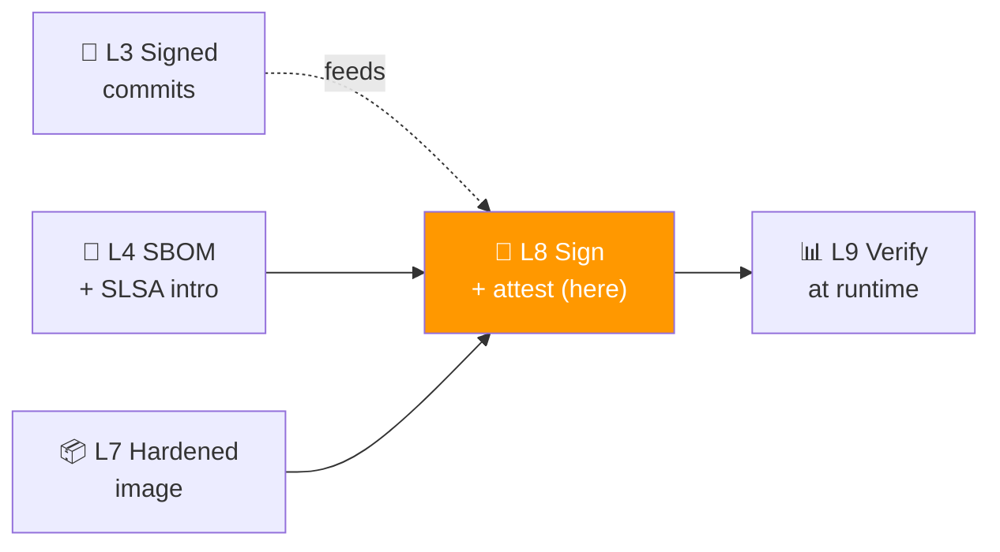
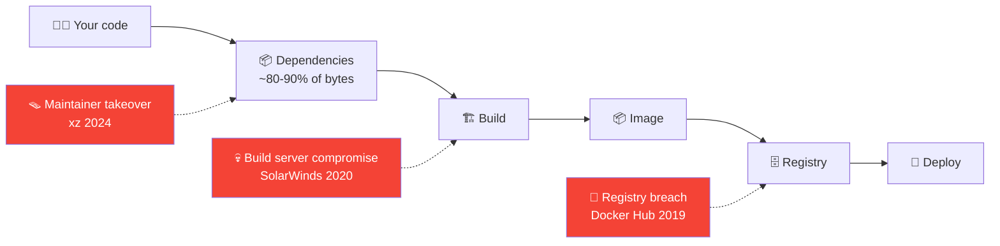
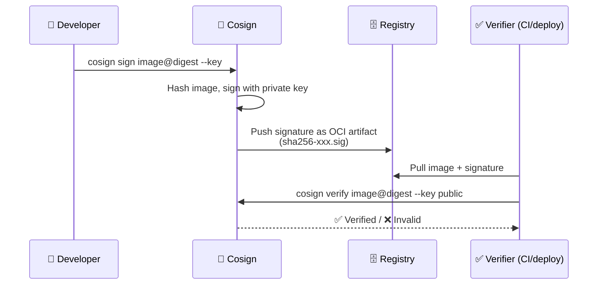
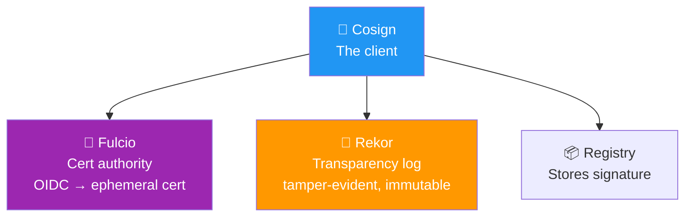
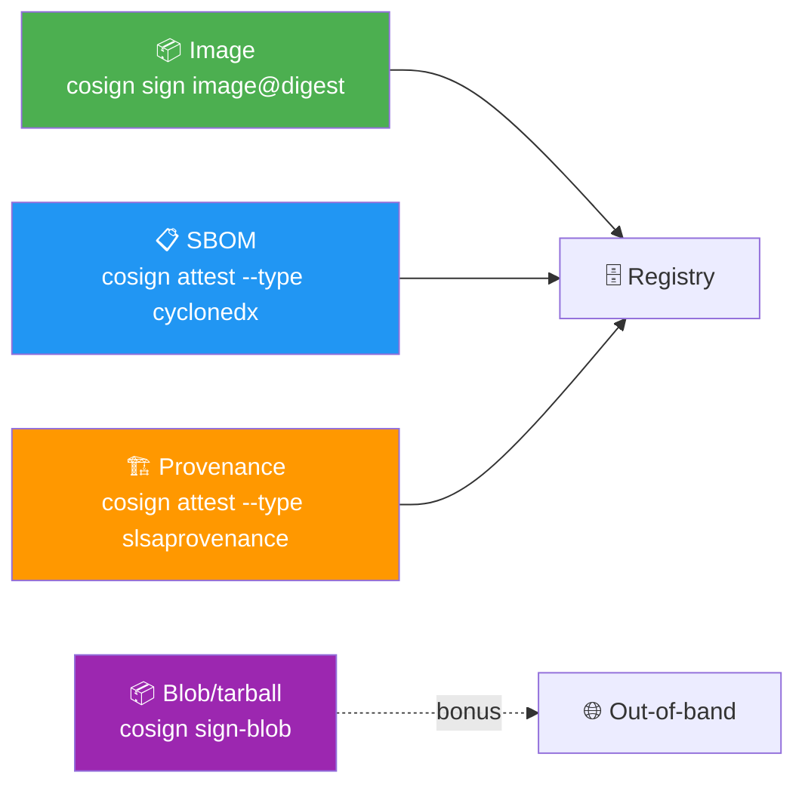

# 📌 Lecture 8 — Supply Chain Security: Signing, Attestation, and the xz Backdoor

---

## 📍 Slide 1 – 🪤 xz-utils: The Backdoor That Almost Made It

* 🗓️ **March 29, 2024** — Andres Freund (Microsoft engineer) investigates a 500ms ssh slowdown on his Debian sid box. He digs into compressed test files. He finds **CVE-2024-3094**: a backdoor in **xz-utils** that hooks `RSA_public_decrypt` in OpenSSH and accepts a hardcoded key
* 🪜 The backdoor was planted by a maintainer (alias "Jia Tan") who spent **two years** building reputation, then merged it into versions 5.6.0 and 5.6.1 in February 2024
* 🌍 Distros affected: Debian sid, Fedora 40 beta, openSUSE Tumbleweed, Kali rolling, **Homebrew**
* 🎯 **Caught by accident, 28 days before stable releases shipped.** Had Andres not noticed the 500ms blip, this would have hit Ubuntu 24.04 LTS and millions of production sshd daemons
* 🧠 **What would have stopped it in CI:**
  * 🔏 **Signed releases verified at install** (Sigstore Cosign) — would have required the attacker to also compromise the maintainer's signing key
  * 📋 **SBOM + reproducible build verification** — the malicious binary embedded in `tests/` differed from a from-source rebuild
  * 🔎 **Anomaly detection on test-data file sizes** — the suspicious blob was multiple MB in a "compression test"

> 🤔 **Think:** xz didn't show up in OWASP Top 10:2021 SSRF rules, in your SAST scanner, or in your SCA database. The whole **supply chain layer** is what catches this class of attack.

---

## 📍 Slide 2 – 🎯 Learning Outcomes

| # | 🎓 Outcome |
|---|-----------|
| 1 | ✅ Explain why supply chain attacks are a distinct class — and which prior labs already protect against parts of it |
| 2 | ✅ Sign a container image with **Cosign** and verify the signature with the public key |
| 3 | ✅ Attach an **SBOM attestation** + a **provenance attestation** to an image |
| 4 | ✅ Recognize the **Sigstore** architecture: Cosign, Fulcio, Rekor — and how keyless signing works |
| 5 | ✅ Pick an appropriate **SLSA Build Level** target for a project and identify what's missing |

---

## 📍 Slide 3 – 🗺️ Where Lecture 8 Sits



* 🪜 **Building on:**
  * L3 — you can already sign commits; signing artifacts is the same idea applied to the output
  * L4 — you have a CycloneDX SBOM from Syft; this lecture wraps it in an attestation
  * L7 — the image you hardened in L7 becomes the subject of Cosign's signature
* 🎯 **Lab 8 alignment:** Task 1 (Cosign sign + tamper demo) + Task 2 (SBOM + provenance attestations) + bonus (blob/script signing — the Codecov 2021 fix)

---

## 📍 Slide 4 – 📜 Why Supply Chain Is a Distinct Layer

> 💬 *"You can't trust anything you didn't build yourself. And you didn't build everything yourself."* — Ken Thompson's classic *"Reflections on Trusting Trust"* (1984, Turing Award lecture) — the original supply-chain paper



* 🪜 **Three classes of supply chain attack:**
  1. **Dependency compromise** (xz 2024, event-stream 2018, ua-parser-js 2021)
  2. **Build server compromise** (SolarWinds 2020, Codecov 2021)
  3. **Registry/distribution compromise** (Docker Hub 2019)
* 🧠 SAST/DAST/IaC scans don't catch any of these. The whole **signing + attestation** layer exists for this exact failure class

---

## 📍 Slide 5 – 🔏 Cosign in 5 Minutes

* 🏢 **Sigstore project** — Linux Foundation, founded **2021** by Red Hat, Google, Purdue, Chainguard
* 🎓 Sigstore project promoted to **OpenSSF Graduated** in **2024**
* 🐹 Cosign: Go binary, single static install
* 🔢 Latest: **Cosign v2.x** (April 2026 stable)
* 🎯 **What Cosign does:**
  * Generate a keypair → sign artifacts → verify signatures
  * Or use **keyless signing** (Sigstore identity → ephemeral cert)
  * Attach **attestations** (SBOMs, provenance, vuln scans) as signed claims
  * Push everything to the registry alongside the image (OCI "referrers" pattern)

```bash
# Lab 8 Task 1 starts here
cosign generate-key-pair                          # creates cosign.key + cosign.pub
cosign sign --key cosign.key ghcr.io/me/juice-shop@sha256:abc...
cosign verify --key cosign.pub ghcr.io/me/juice-shop@sha256:abc...
```

---

## 📍 Slide 6 – 🪪 Cosign Architecture: Sign and Verify



* 🪜 **Critical detail:** Cosign signs the **digest** of the image (`@sha256:...`), not the tag. Tags are mutable; digests aren't (recall L4)
* 🧠 The signature is itself an OCI artifact stored at `sha256-<digest>.sig`. Compatible with any OCI-spec registry (GHCR, ECR, Docker Hub, Harbor, Quay, distribution v3)

---

## 📍 Slide 7 – 🪪 Keyless Signing: No Private Key to Lose

* 🚨 **The traditional signing problem:** if your `cosign.key` leaks, your signatures are worthless (attackers can sign their malware as you)
* 💡 **Keyless signing** (Sigstore's defining innovation):
  * No long-lived private key
  * Cosign requests a **short-lived certificate** from **Fulcio** (Sigstore's CA), authenticated via OIDC (GitHub Actions, your Google account, etc.)
  * Certificate is valid for **10 minutes**
  * Cosign signs with the cert's ephemeral key
  * Signature + cert are uploaded to **Rekor** (transparency log) and to the registry

```bash
# Keyless sign — no key file, requires browser OIDC or GHA OIDC
cosign sign ghcr.io/me/juice-shop@sha256:abc...
# (opens browser for one-time GitHub/Google OAuth)

# Keyless verify — proves "signed by this GitHub identity from this workflow"
cosign verify ghcr.io/me/juice-shop@sha256:abc... \
  --certificate-identity-regexp "https://github.com/me/.+" \
  --certificate-oidc-issuer https://token.actions.githubusercontent.com
```

* 🪜 **Why this is huge:** in CI (GitHub Actions OIDC, L4), every signing operation is auditable in Rekor by anyone. **You can't quietly sign a malicious artifact** — it gets logged publicly

---

## 📍 Slide 8 – 🌳 Sigstore: Cosign, Fulcio, Rekor



| 🧱 Component | 🎯 Purpose |
|---|---|
| **Cosign** | Client tool — signs, verifies, attaches attestations |
| **Fulcio** | Free CA that issues 10-minute certs based on OIDC identity |
| **Rekor** | Immutable transparency log of every signature ever issued |
| **TUF** | The root-of-trust system distributing Fulcio's root cert |

* 🪜 **The transparency log is the breakthrough.** Anyone (including security teams at orgs that don't use Sigstore) can query Rekor and see "who signed what when". Backdating signatures becomes impossible
* 🧠 If you're curious: `rekor-cli search --artifact <hash>` shows every signature ever made of an artifact

---

## 📍 Slide 9 – 📜 Attestations: Beyond "It's Signed"

A **signature** proves *who*. An **attestation** proves *what*.

```json
{
  "_type": "https://in-toto.io/Statement/v1",
  "subject": [
    { "name": "ghcr.io/me/juice-shop",
      "digest": { "sha256": "abc..." } }
  ],
  "predicateType": "https://cyclonedx.org/bom/v1.5",
  "predicate": {
    "bomFormat": "CycloneDX",
    "specVersion": "1.5",
    "components": [ ... ]
  }
}
```

* 🪜 **in-toto attestation format** = the standard envelope. Subject identifies what's being attested; predicate is the claim's content
* 🪜 Common predicate types:
  * `https://cyclonedx.org/bom/v1.5` — CycloneDX SBOM
  * `https://spdx.dev/Document/v2.3` — SPDX SBOM
  * `https://slsa.dev/provenance/v1` — SLSA build provenance
  * `https://cosign.sigstore.dev/attestation/vuln/v1` — vuln scan results

* 🪜 **Lab 8 Task 2** attaches a CycloneDX SBOM attestation (from Lab 4) + a SLSA provenance attestation to the image you hardened in Lab 7

---

## 📍 Slide 10 – 📋 SBOM Attestation in Practice

```bash
# Lab 4 produced this file
ls labs/lab4/sbom.cdx.json

# Sign and attach it to the image as a CycloneDX-formatted in-toto attestation
cosign attest \
  --type cyclonedx \
  --predicate labs/lab4/sbom.cdx.json \
  --key cosign.key \
  ghcr.io/me/juice-shop@sha256:abc...

# Anyone can now pull + verify
cosign verify-attestation \
  --key cosign.pub \
  --type cyclonedx \
  ghcr.io/me/juice-shop@sha256:abc... | jq '.payload | @base64d | fromjson'
```

* 🪜 **Operational value:** when the next Log4Shell arrives, you query the attestation, not the source repo — *"do any of my images attest to depending on Log4j 2?"*
* 🧠 **The chain effect:** L4 made the SBOM → L8 signs it → L9 verifies it before deploy → L10 imports it into DefectDojo. **One file, four labs of leverage.**

---

## 📍 Slide 11 – 🪜 SLSA v1.0 Recap (Building on L4)

Recall from Lecture 4 — SLSA Build Levels. Now you have the *tools* to actually meet them:

| 🪜 Level | 🎯 Requirement | 🛠️ Lab tooling |
|---|---|---|
| Build L1 | Provenance exists | A signed in-toto attestation produced by your CI |
| Build L2 | Provenance is signed by the build system | Cosign keyless signing (Lab 8) |
| Build L3 | Build platform itself is hardened, non-falsifiable | GitHub Actions OIDC reusable workflow + Cosign |

* 🪜 **GitHub Actions can produce SLSA L3 for free.** The `slsa-github-generator` (OpenSSF) or the newer `gh attestation` command both work
* 🪜 Lab 8 Bonus task (signing a tarball / blob) is the same Cosign API applied to non-OCI artifacts — `cosign sign-blob`. The Codecov 2021 incident is the canonical case for this — signing the `bash` uploader they distributed

---

## 📍 Slide 12 – 🛡️ Verification at Deploy: The Other Half

A signature you don't verify is decoration.

```yaml
# K8s admission policy (Kyverno example)
apiVersion: kyverno.io/v1
kind: ClusterPolicy
metadata:
  name: require-signed-images
spec:
  validationFailureAction: enforce
  rules:
    - name: check-cosign-signature
      match:
        any:
          - resources:
              kinds: [Pod]
      verifyImages:
        - imageReferences: ["ghcr.io/me/*"]
          attestors:
            - entries:
                - keys:
                    publicKeys: |
                      -----BEGIN PUBLIC KEY-----
                      ...
                      -----END PUBLIC KEY-----
```

* 🪜 **Same pattern in:** Sigstore's `policy-controller`, Connaisseur, Notary v2 — all do K8s-admission-time signature verification
* 🪜 **In Lab 9** you'll verify signatures at deploy time as part of the runtime story. Lab 8 establishes them; Lab 9 enforces them

---

## 📍 Slide 13 – 🔬 Case Study: ua-parser-js Compromise (2021)

* 🗓️ **October 22, 2021** — npm package `ua-parser-js` (8M weekly downloads) is hijacked. Maintainer's account compromised; three malicious versions published over 4 hours: 0.7.29, 0.8.0, 1.0.0
* 🦠 The packages include **cryptominers (XMRig)** and **password stealers**
* 🌐 Affected: any project running `npm install` during that 4-hour window
* 🛡️ **What would have helped:**
  * **npm Provenance** (released 2023) — signed attestation proving the artifact came from a specific GitHub Actions workflow on a specific commit. Verifies via Sigstore
  * **Strict lockfile pinning** + integrity hashes (`package-lock.json` already does this for transitive deps)
  * **Cosign verification** of npm packages — the toolchain exists; few teams enable it
* 🧠 **The bigger pattern:** in 2021 there was no way to verify *who* published an npm package. By 2024 there is. Adoption is still uneven

---

## 📍 Slide 14 – 🔬 Case Study: xz Reconsidered

Back to xz-utils 2024 with the lecture's tools in hand:

| 🪜 Control | 🛡️ Would it have stopped xz? |
|---|---|
| **Signed releases (Cosign keyless)** | Partial — attacker also controlled the maintainer's signing identity; would need community-of-maintainers signature |
| **SBOM attestation** | The SBOM would list xz-utils 5.6.0 — but the bug is in **what xz does at runtime**, not what version says it is |
| **Reproducible builds** | ✅ Strong — the released binary differed from a from-source rebuild; reproducible build verification would have flagged this |
| **In-toto provenance — every link signed** | ✅ Strong — would have required the attacker to compromise the entire chain (commit → build → test → release), not just the package |

* 🧠 **No silver bullet.** xz showed that even with Cosign, SBOM, and signed packages, a **patient attacker with maintainer privileges** can ship a backdoor. Reproducible builds + community signing are the deeper defenses

> 💬 *"xz-utils proved that supply chain security is not a tool you buy. It's a discipline you maintain."* — Filippo Valsorda, Cryptographers' Mailing List, April 2024

---

## 📍 Slide 15 – 🌊 The "in-toto Layout" Model

* 📜 **in-toto** is a CMU project (since 2017); the underlying spec for everything Sigstore does
* 🪜 The mental model: every step in your pipeline produces a **link** (a signed claim about what happened), and a **layout** describes the required steps + their valid producers
* 🪜 In practice today (2026), most orgs use Cosign attestations (which use in-toto envelope) rather than the full in-toto layout system, because Cosign is enough

* 🎯 **What you should know for interviews:**
  * "in-toto" = the standard for software supply chain attestations
  * "Sigstore" = the implementation infrastructure (Cosign + Fulcio + Rekor)
  * "SLSA" = the maturity ladder

* 🧠 You don't need to learn the full in-toto spec for this course. **The Cosign + attestation flow is what 99% of teams ship in 2026**

---

## 📍 Slide 16 – 🪜 The Three Things You'll Sign in Lab 8



| 🏷️ What | 🪜 Why |
|---|---|
| The image itself | Primary artifact; proves who built it |
| The SBOM (from L4) | Proves what's inside; queryable for future CVEs (Log4Shell pattern) |
| Provenance | Proves *how* it was built — which commit, which workflow, which build server |
| Blob/tarball (bonus) | The same `cosign sign-blob` pattern that would have stopped Codecov 2021 |

* 🪜 All four signatures go to **the same registry alongside the image**. One pull = everything you need to verify trust

---

## 📍 Slide 17 – 🛠️ Common Mistakes & Fixes

| 🚨 Mistake | 🛠️ Fix |
|---|---|
| Signing the tag, not the digest | `cosign sign image@sha256:...` always (tags are mutable) |
| Private key checked into repo | Use keyless signing OR store key in cloud KMS (cosign supports GCP/AWS/Azure KMS) |
| Signing but never verifying | Wire `cosign verify` into deploy admission controller (Kyverno / policy-controller) |
| Attestation predicate types invented | Use standard URIs (`cyclonedx.org/bom/v1.5`, `slsa.dev/provenance/v1`) — non-standard ones break interop |
| Forgetting to push the public key (or trust policy) to verifiers | Document the verification command alongside the build pipeline |

---

## 📍 Slide 18 – 🪜 In CI (The Last Pipeline Stage You'll Add)

```yaml
# .github/workflows/release.yml — runs after L4/L5/L6/L7 all pass
jobs:
  sign-and-attest:
    needs: [test, sast, dast, image-scan]
    permissions:
      id-token: write     # OIDC for Cosign keyless
      contents: read
      packages: write     # push to GHCR
      attestations: write
    steps:
      - uses: sigstore/cosign-installer@v3.7.0
      - name: Cosign keyless sign
        run: cosign sign --yes ghcr.io/${{ github.repository }}@${{ steps.build.outputs.digest }}
      - name: Attach SBOM attestation
        run: cosign attest --yes --type cyclonedx --predicate sbom.cdx.json ...
      - name: Attach SLSA provenance
        uses: slsa-framework/slsa-github-generator/.github/workflows/generator_container_slsa3.yml@v2.0.0
        with: { image: ghcr.io/${{ github.repository }}, digest: ${{ steps.build.outputs.digest }} }
```

* 🪜 **What this gives you:** SLSA Build Level 3 + signed SBOM + provenance, all from a free GitHub Actions runner with OIDC
* 🧠 **What it doesn't give you:** verification. That's the *next* layer (L9) — admission-time enforcement

---

## 📍 Slide 19 – ⏭️ What's Next + Lab Preview

* 🧪 **Lab 8** (this week):
  * Task 1 (6 pts): Spin up local registry, sign the Juice Shop image with Cosign, demonstrate tamper detection
  * Task 2 (4 pts): Attach SBOM (from Lab 4) + provenance attestations
  * Bonus (2 pts): Sign a blob/tarball with `cosign sign-blob` — the Codecov 2021 mitigation pattern
* 🚀 **Lecture 9** (next week): **Monitoring, Compliance & Maturity** — Falco runtime detection + Conftest policy-as-code + the metrics that make a program (MTTR, vuln age, OWASP SAMM). We start *verifying* the signatures you just attached, at runtime

---

## 📍 Slide 20 – 📚 Resources & Takeaways

**Books:**

| 📖 Book | ✍️ Why |
|---|---|
| *Software Supply Chain Security* — Cassie Crossley (Manning, 2024) | Best single book; chapters 6–7 are pure attestation + signing |
| *Securing the Software Supply Chain* — Tom Stuart (O'Reilly, 2024) | Pairs perfectly with this lecture; lighter touch, ch. 4 on Sigstore |
| *Reflections on Trusting Trust* — Ken Thompson (1984, free PDF, 6 pages) | The original — still the most important essay in supply chain security |

**Talks & specs:**

* 🎥 *"Sigstore: Software Signing for Everybody"* — Luke Hinds (Sigstore founder), KubeCon 2022
* 🎥 *"The xz Backdoor — Engineering Postmortem"* — Andres Freund, BSD Can 2024
* 📜 [Sigstore Documentation](https://docs.sigstore.dev/)
* 📜 [SLSA v1.0](https://slsa.dev/spec/v1.0/)
* 📜 [in-toto Attestation Spec](https://github.com/in-toto/attestation)
* 📜 [Cosign reference](https://docs.sigstore.dev/cosign/system_config/specifications/)

**Takeaways:**

| # | 🧠 Insight |
|---|---|
| 1 | Supply chain attacks bypass SAST, DAST, and SCA. Signing + attestation are the layer designed to catch them. |
| 2 | Cosign keyless signing removes the "private key leak" failure mode entirely. Use it. |
| 3 | A signature proves WHO. An attestation proves WHAT. You usually need both. |
| 4 | The transparency log (Rekor) is the breakthrough — signing becomes publicly auditable. |
| 5 | xz-utils 2024 is the modern xy: even with signing, a patient maintainer can backdoor. Reproducible builds + community signing are the deeper defenses. |
| 6 | A signature you don't verify is decoration. Admission-time verification (L9) is non-optional. |

> 💬 *"You cannot trust code that you did not totally create yourself."* — Ken Thompson, Turing Award lecture, 1984. The original supply-chain paper. Read it before lecture 9.
