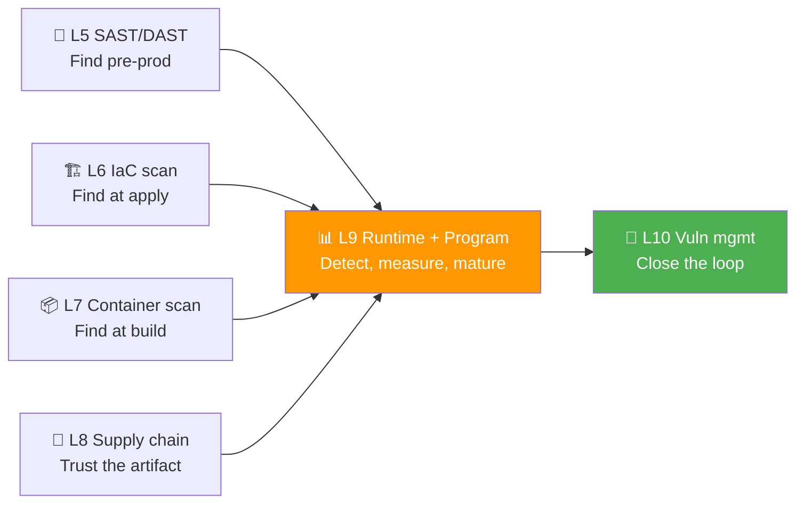
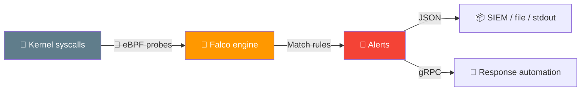
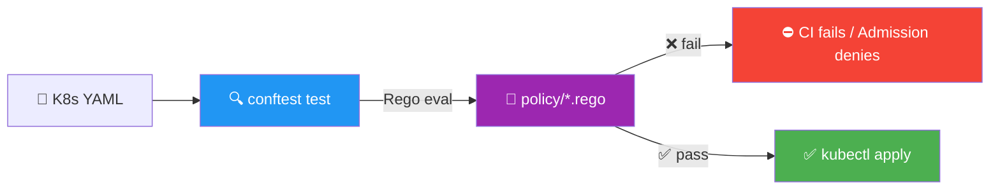
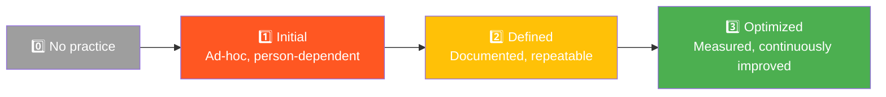
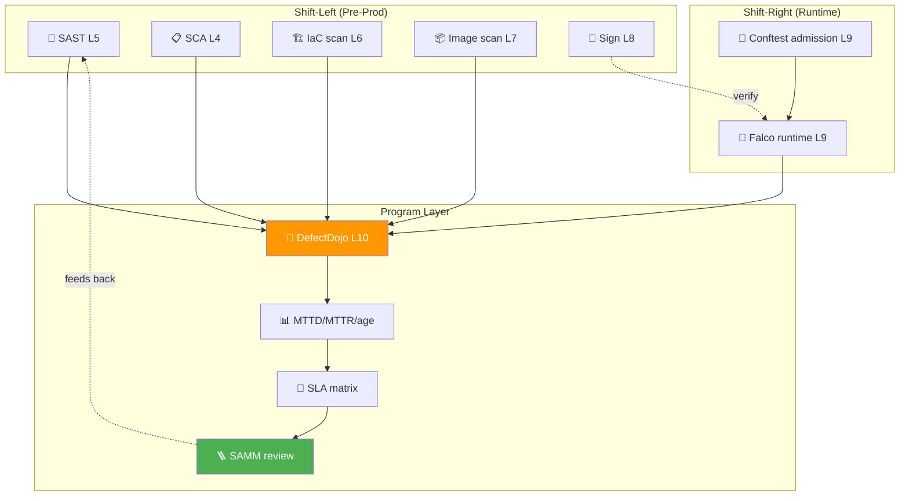

# 📌 Lecture 9 — Monitoring, Compliance & Maturity: From Findings to a Program

---

## 📍 Slide 1 – 🚨 The Alerts Nobody Read

* 🗓️ **November 30, 2013** — Target's FireEye intrusion detection system fires on POS-malware traffic to Russia
* 🛒 Same week: a second alert, same exfiltration pattern, same destination
* 📧 Both alerts route to a SOC in Bangalore. They flow up to HQ — and get **set aside**
* 💳 By the time anyone responds: **40 million card numbers + 70 million customer records** are gone
* 💰 Final settlement: **$18.5M** to 47 states. Bryan Krebs breaks the story two weeks later — Target heard it from a journalist first
* 🔥 The defense wasn't broken. **The feedback loop was.**

> 🤔 **Think:** If your scanner finds 200 criticals but nobody reads the report, did you detect anything? A finding without a workflow is noise.

---

## 📍 Slide 2 – 🎯 Learning Outcomes

| # | 🎓 Outcome |
|---|-----------|
| 1 | ✅ Explain why runtime detection complements (does not replace) shift-left checks |
| 2 | ✅ Write a Falco rule that detects a specific runtime behavior, using eBPF |
| 3 | ✅ Express deployment-hardening rules as Rego policies executed by Conftest |
| 4 | ✅ Choose security metrics that drive behavior change (MTTD, MTTR, vuln age) |
| 5 | ✅ Place a team on the OWASP SAMM maturity ladder and propose one concrete next step |

---

## 📍 Slide 3 – 🗺️ Where Lecture 9 Sits in the Course



* 🪜 Lectures 1–8 taught you to **find** issues at increasingly earlier stages
* 🏃 Lecture 9 covers what happens **once code is running** and **how the program itself matures**
* 🎁 Lecture 10 will close the loop: triage every finding from Labs 4–9 in DefectDojo

---

## 📍 Slide 4 – 🛡️ Shift-Left ≠ Shift-Only-Left

> 💬 *"You can shift left as far as you want — attackers still get to attack the running system."* — Liz Rice, *Container Security* (O'Reilly, 2020)

| 🏷️ Stage | 🔍 Checks | 🛠️ Tools (from this course) | ❌ What it can't catch |
|---|---|---|---|
| 📝 **Pre-commit** | Secret scan, signed commits | gitleaks, SSH signing (L3) | Anything you don't commit |
| 🏗️ **Build** | SAST, SCA, image scan | Semgrep, Grype, Trivy (L4,5,7) | Vulns in transitive deps loaded at runtime |
| 🚀 **Deploy** | Policy-as-code, supply-chain verify | Conftest *(this lecture)*, Cosign verify (L8) | A compromised registry serving a different image |
| 🏃 **Runtime** | Behavior detection, anomaly | **Falco** (this lecture) | Drift between IaC source and live cluster |

* 🎯 **The point:** each stage catches a different failure class. Runtime is the **last line of defense** — and the only one that sees what an attacker actually does

---

## 📍 Slide 5 – 👁️ Runtime Detection — The Mental Model

Static tools answer *"could this be exploited?"*. Runtime tools answer *"is this being exploited **right now**?"*



* 🐝 **eBPF** = "extended Berkeley Packet Filter" — sandboxed programs run in the kernel without loading a module
* 🎯 Falco taps syscalls (process exec, file open, network connect) and matches them against a rule library
* 📜 Rule language is YAML; conditions are a small expression DSL over syscall fields

> 🧠 **Why eBPF won:** the older kernel-module driver required matching the host kernel version. eBPF is portable across recent kernels (5.8+ for the modern driver), runs in user-controlled bytecode, and is verifiable before load.

---

## 📍 Slide 6 – 🦅 Falco: A Short History

* 🏢 Created at **Sysdig** by **Loris Degioanni** (also co-author of Wireshark) in 2016
* 📜 Donated to the **CNCF** as a Sandbox project on **October 10, 2018**
* 📈 Promoted to Incubating on **January 8, 2020**
* 🎓 **Graduated** to CNCF Graduated on **February 29, 2024** — alongside KEDA, joining only a handful of security-focused CNCF projects
* 🔢 Course pins **Falco v0.43.x** (January 2026) — the version your lab uses
* 🧱 Three engines historically: legacy kernel module → eBPF probe → **modern eBPF** (default since 0.34). Lab uses modern eBPF.

> 💬 *"Falco isn't trying to be your IDS. It's trying to be the runtime equivalent of `grep` — fast, predictable, and composable."* — Leonardo Grasso, Falco maintainer

---

## 📍 Slide 7 – 📝 Anatomy of a Falco Rule

```yaml
- rule: Write to /etc by container
  desc: Container modifying system config under /etc
  condition: >
    open_write and
    container.id != host and
    fd.name startswith /etc/
  output: >
    Config write in container (user=%user.name container=%container.name
    file=%fd.name proc=%proc.cmdline)
  priority: WARNING
  tags: [container, drift, mitre_persistence]
```

| 🏷️ Field | 🎯 Purpose |
|---|---|
| `rule` | Human-readable name (unique) |
| `desc` | Why this rule exists |
| `condition` | Boolean expression on syscall fields |
| `output` | Alert message template, `%field` interpolated |
| `priority` | EMERGENCY..DEBUG — mostly used for routing |
| `tags` | Free-form labels; common to map to MITRE ATT&CK techniques |

* 🧪 Macros (`open_write`, `container_started`, ...) ship with the default ruleset — read `/etc/falco/falco_rules.yaml` once
* 🎯 In the lab you'll add **one custom rule**; the default ruleset already covers ~200 conditions

---

## 📍 Slide 8 – 🔉 Tuning Noise: the Rule That Cried Wolf

* 🚨 Default rules fire on legitimate behavior all the time — `apt-get update` writes under `/var/lib/dpkg`, kubelet writes to `/var/lib/kubelet`
* 🤐 Tuning options, in order of preference:
  1. **Refine the condition** — add an exception clause (`and not proc.name=apt-get`)
  2. **Use the `exceptions:` block** (Falco 0.28+) — structured, easier to audit than long `and not` chains
  3. **Disable the rule** — last resort, document why
* 📊 Signal-to-noise is the **only** metric that matters for a detection program. A rule that fires 200×/day with 0 incidents will be silenced — by humans or by mute filters

> 🤔 **Think:** Why is "false positive" the wrong word for security detections? (Hint: a noisy true-positive is still useless if no one looks at it.)

---

## 📍 Slide 9 – 📜 Policy-as-Code: Hardening Before Deploy

Falco catches behavior **after** it happens. **Policy-as-code** prevents bad config from ever being applied.



* 🔧 **Conftest** (CNCF, by Garet Hilliard, 2019) wraps **OPA** (Open Policy Agent) so you can run Rego policies against any structured file: YAML, JSON, HCL, Dockerfile, INI
* 🔢 Course pins **Conftest v0.68.2** (April 2026)
* 🆚 Conftest is **CLI/CI**; the same Rego runs server-side as a **Gatekeeper** or **Kyverno** webhook (Kyverno uses its own DSL, but the role is identical)

---

## 📍 Slide 10 – 🧮 Rego in 60 Seconds

```rego
package main

deny[msg] {
  input.kind == "Deployment"
  c := input.spec.template.spec.containers[_]
  c.securityContext.runAsNonRoot != true
  msg := sprintf("container %q must set runAsNonRoot: true", [c.name])
}
```

| 🧩 Construct | 🎯 Meaning |
|---|---|
| `package main` | Default package Conftest evaluates |
| `deny[msg] { ... }` | A rule that, when body is true, adds `msg` to the deny set |
| `input` | The parsed YAML/JSON document |
| `[_]` | "For each element" — implicit iteration |
| `sprintf` | Built-in for formatted messages |

* 🧠 Rego is **declarative**: you write *conditions for failure*, not procedures
* 📚 OPA documentation has a 30-minute interactive tutorial (`play.openpolicyagent.org`) — worth doing before Lab 9 Task 2

---

## 📍 Slide 11 – 📊 Security Metrics That Drive Behavior

> 💬 *"What gets measured gets managed."* — often attributed to Peter Drucker (no record of him saying it). Either way it's true for security programs.

| 📏 Metric | 🧮 Formula | 🎯 What it answers |
|---|---|---|
| ⏱️ **MTTD** (Mean Time To Detect) | avg(detect_time − introduction_time) | How fast does our pipeline find issues? |
| 🩹 **MTTR** (Mean Time To Remediate) | avg(close_time − detect_time) | How fast do we fix? |
| ⌛ **Vuln Age** | now − first_seen, per finding | What's our debt distribution? |
| 📈 **Backlog Trend** | open_findings(t) − open_findings(t−Δ) | Are we keeping up with new findings? |
| 🎯 **SLA Compliance** | % findings closed within severity-based SLA | Are we triaging by risk? |

* 🚫 **Anti-metrics** (look impressive, change nothing): number of scans run, total alerts generated, lines of policy. They reward activity, not outcomes
* ✅ The lab and Lecture 10 will compute MTTR + vuln-age from real DefectDojo data

---

## 📍 Slide 12 – 🚦 Severity-Based SLAs (an example matrix)

| 🚨 Severity | 🩹 Fix SLA | 📋 Owner | 📣 Escalation |
|---|---|---|---|
| 🔴 Critical (CVSS 9–10) | **24h** | On-call + Security Lead | Page on creation |
| 🟠 High (7–8.9) | **7 days** | Service team | Slack channel + ticket |
| 🟡 Medium (4–6.9) | **30 days** | Service team | Backlog grooming |
| 🔵 Low (0.1–3.9) | **90 days / accept** | Tech lead | Quarterly review |

* 🧭 Without an SLA matrix, every finding becomes "P3 — someday"
* 🎯 The matrix is also your **defense for risk acceptance** — if you choose not to fix a Medium, you've explicitly accepted a 30-day exposure that the matrix says is acceptable

---

## 📍 Slide 13 – 🚀 DORA Meets DevSecOps

The **2018 *Accelerate* book** (Forsgren, Humble, Kim) defined four DORA metrics for engineering performance:

| 🏷️ DORA metric | 🚀 Engineering meaning | 🔐 DevSecOps adaptation |
|---|---|---|
| 🚢 Deployment Frequency | How often you ship | How often you ship a security fix |
| ⏱️ Lead Time for Changes | Commit → prod | Vuln discovery → patch in prod |
| ❌ Change Failure Rate | % deploys causing prod incidents | % security-fix deploys causing rollback |
| 🩹 MTTR (service) | Time to restore service | Time to remediate a vuln |

* 📚 The annual **DORA report** (Google Cloud since 2014) is the most cited engineering-performance research; the 2024 report added security practices as a top performance predictor
* 🧪 **Elite performers** deploy >1×/day, have lead time <1 hour, change failure rate <15%, MTTR <1 hour — security teams that match these numbers tend to ship patches in hours, not weeks

---

## 📍 Slide 14 – 🏛️ Compliance Frameworks — A Survival Map

You won't *implement* a framework in this course. You should be able to recognize what each one cares about so you can talk to a compliance officer without freezing.

| 📜 Framework | 🎯 Scope | 🔑 What it cares about | 📅 Key date |
|---|---|---|---|
| 🇪🇺 **GDPR** | Personal data of EU residents | Lawful basis, breach notification (72h), data subject rights | Enforced **25 May 2018** |
| 🇺🇸 **NIST CSF 2.0** | US critical infra (voluntary, widely adopted) | Govern, Identify, Protect, Detect, Respond, Recover | Released **February 2024** (added "Govern") |
| 🌐 **ISO/IEC 27001:2022** | Information Security Management System | Risk-based ISMS + Annex A controls | Latest revision **October 2022** |
| 💳 **PCI DSS 4.0** | Card payment data | Network seg, encryption, log retention | Mandatory from **March 2025** |

* 🧭 **Pattern:** they all want the same things — risk register, controls mapped to risks, logged evidence, periodic review. The vocabulary differs
* 🪜 GDPR's **72-hour breach notification** is the single rule most likely to bite an engineering team unaware

---

## 📍 Slide 15 – 🪜 OWASP SAMM — Where Is Your Team?

The **Software Assurance Maturity Model** (OWASP project, originally by **Pravir Chandra** 2009; SAMM 2.0 released 2019) gives a 4-level maturity ladder across 5 business functions × 15 security practices.



| 🏛️ Business function | 🧩 Practices (3 each) |
|---|---|
| **Governance** | Strategy & Metrics · Policy & Compliance · Education & Guidance |
| **Design** | Threat Assessment · Security Requirements · Security Architecture |
| **Implementation** | Secure Build · Secure Deployment · Defect Management |
| **Verification** | Architecture Assessment · Requirements-Driven Testing · Security Testing |
| **Operations** | Incident Management · Environment Management · Operational Management |

* 🆚 **BSIMM** (Building Security In Maturity Model, Synopsys/Black Duck) does the same thing **descriptively** — annual report on what real orgs do. Latest is **BSIMM16** (January 2026, 111 orgs)
* 🧭 **Use SAMM** to set goals; **read BSIMM** to see what your industry peers actually do

---

## 📍 Slide 16 – 🔬 Case Study: Equifax (2017)

* 🗓️ **March 7, 2017** — Apache Struts CVE-2017-5638 published (CVSS 10.0). Patch available same day
* 🛡️ Equifax's security team emails the patch directive across the org on March 9
* 🌀 The vulnerable web portal **was not on the inventory** the directive used. It is missed
* 📡 Scans run two weeks later — but the SSL certificate on the IDS was **expired** for 10 months. Encrypted attack traffic flows past the inspector unread
* 💸 Attackers exfiltrate **147 million records** between May and July; CEO and CISO resign; total cost > $1.4B
* 🧠 **What failed:** inventory (Identify), patch process (Protect), monitoring (Detect), comms (Respond). NIST CSF functions in a row

> 🤔 **Think:** Which OWASP SAMM practice would have caught this earliest — Defect Management, Environment Management, or Incident Management? (Trick: all three; one would have been enough.)

---

## 📍 Slide 17 – 🔬 Case Study: SolarWinds (2020)

* 🗓️ **March 2020** — attackers (later attributed to APT29 / Cozy Bear) inject **SUNBURST** into the SolarWinds Orion build pipeline
* 📦 Backdoored update ships to ~**18,000 customers** including DoD, Treasury, FireEye
* 👁️ FireEye discovers it **December 8, 2020** — after the malware tries to enroll a second auth device for an employee. The MFA workflow alerts. *That* alert was read
* 🎯 **The supply chain check missed**, but **runtime + IAM monitoring caught it** — about 9 months in, but caught
* 🪜 This is why this course teaches you both **L8 (signing/verification)** and **L9 (runtime detection)** — neither is sufficient alone

---

## 📍 Slide 18 – 🛠️ A Working DevSecOps Program in One Diagram



* 🎯 Each box was a lab. Lecture 10 wires the program layer together
* 🪜 The feedback arrow is the whole point — a security program that doesn't re-prioritize its scanning based on what it found is just a budget line

---

## 📍 Slide 19 – 🛣️ What's Next (Lecture 10)

Lecture 10 takes everything in the program layer above and walks the **vulnerability management lifecycle**:

1. 🔎 **Discovery** — ingest from all the tools you've configured (Labs 4–9)
2. 🏷️ **Triage** — dedup, assign severity, push to SLA queue
3. 🩹 **Remediation** — fix, suppress with reason, or accept with expiry
4. 📊 **Reporting** — close the loop to the program metrics on the previous slide
5. 🪜 **Improvement** — feed findings into next-cycle SAMM goals

* 🧪 Lab 10 brings up **DefectDojo v2.58.x** locally and imports every report you've generated in Labs 4–9
* 📚 By the end of Lab 10 you'll have a single dashboard showing every CVE the course exposed you to — and an MTTR distribution to argue about

---

## 📍 Slide 20 – 📚 Resources & Takeaways

**Books (pick one to read this term):**

| 📖 Book | ✍️ Why |
|---|---|
| *Securing DevOps* — Julien Vehent (Manning, 2018) | Runs through real Mozilla pipelines; ch. 5–7 on monitoring are the closest match to this lecture |
| *Container Security* — Liz Rice (O'Reilly, 2020) | Best single chapter (ch. 11) on runtime security; explains why eBPF won |
| *Accelerate* — Forsgren, Humble, Kim (IT Revolution, 2018) | The DORA metrics, with the research methodology behind them |
| *Building Secure & Reliable Systems* — Google (O'Reilly, 2020, free PDF) | Chapter on detection + response from people running it at planetary scale |

**Talks:**

* 🎥 *"What Happens When Falco Detects?"* — KubeCon EU 2024, Loris Degioanni
* 🎥 *"OPA: The Universal Policy Engine"* — Tim Hinrichs, Styra (2021)
* 🎥 *"The DevOps Handbook in 2024"* — Gene Kim, DevOps Enterprise Summit

**Standards & specs:**

* 📜 [OWASP SAMM v2.0](https://owaspsamm.org/) — full assessment toolkit, free
* 📜 [NIST CSF 2.0](https://www.nist.gov/cyberframework) — released Feb 2024, includes the new Govern function
* 📜 [Falco Rules Reference](https://falco.org/docs/rules/) — every default rule, with examples
* 📜 [Rego Playground](https://play.openpolicyagent.org/) — interactive tutorial, 30 minutes

**Takeaways:**

| # | 🧠 Insight |
|---|---|
| 1 | Shift-left finds; shift-right catches what shift-left missed. You need both. |
| 2 | A finding without an owner and an SLA is noise. The matrix is the program. |
| 3 | MTTD/MTTR/vuln-age beat scan counts. Reward outcomes, not activity. |
| 4 | SAMM tells you where to go; BSIMM tells you where your peers actually are. |
| 5 | Compliance is downstream of risk management, not the other way around. |

> 💬 *"The goal of detection is response. The goal of response is learning. The goal of learning is preventing the next one."* — adapted from Richard Bejtlich, *The Practice of Network Security Monitoring* (No Starch, 2013)
