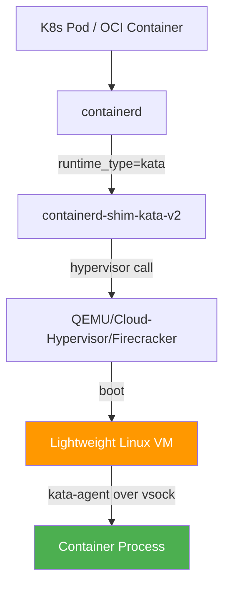
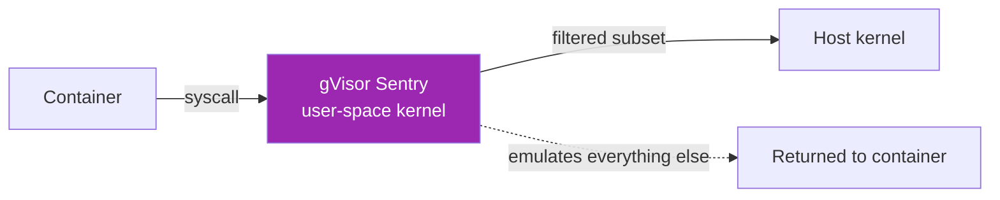
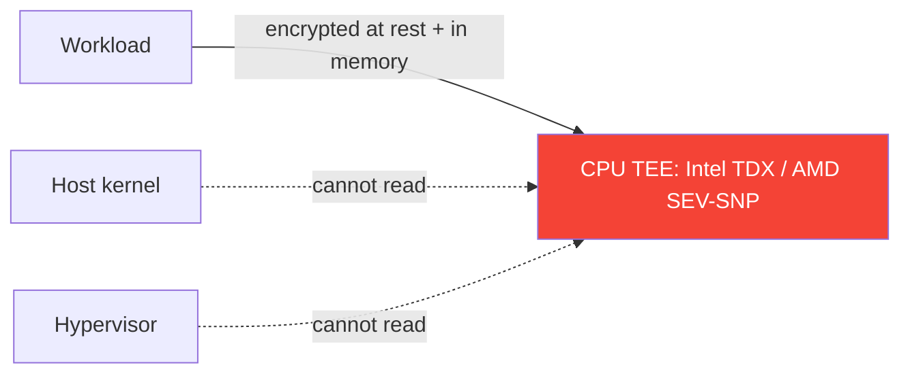

# 📖 Reading 12 — VM-Backed Containers + Confidential Computing

> **Self-study material for Bonus Lab 12.** Read before starting the lab.

---

## The "Containers Don't Contain" Problem (Recap)

Lecture 7 opened with Liz Rice's observation: *"A container is just a Linux process with a particularly fancy set of namespaces and cgroups."* The implication: containers **share** the host kernel. A kernel CVE — or a runc CVE like 2024-21626 ("Leaky Vessels") — is a container escape risk that the application code, the image, and the network controls can't prevent.

For the vast majority of workloads, the shared-kernel model is fine. The trade-off is:

| Property | Container (runc) | VM (KVM) |
|---|---|---|
| Boot time | ~50ms | ~1–5s |
| Memory overhead | ~5MB | ~50–300MB |
| CPU overhead | <1% | ~3–10% |
| Isolation | Process-level (kernel-shared) | Hardware-virtualized |
| Tooling ecosystem | Mature, container-native | Heavyweight, traditional ops |

VMs cost real performance; containers carry real isolation risk. **Sandboxed runtimes** like Kata Containers try to give you the container ergonomics + VM isolation at *some* cost — typically 1-2x cold-start time and 5-20% I/O overhead.

This reading walks the landscape: Kata, gVisor, Firecracker, and the emerging Confidential Computing frontier.

---

## Kata Containers: The Mainstream VM-Sandbox

* 🏢 **Hosted at OpenStack Foundation** since 2017 (merger of Intel Clear Containers + Hyper.sh runV)
* 🐹 Written in **Go** (CRI plugin) + **Rust** (the agent runs inside the VM)
* 🔢 Latest: **Kata Containers v3.x** (April 2026)
* 🪜 Used in production by: **Ant Group**, **Baidu**, **Adobe** (some workloads), **DigitalOcean Kubernetes** as an opt-in runtime

### How Kata Works



Key details:

1. **One micro-VM per container** (or per pod, depending on config). The micro-VM has its own kernel.
2. **The hypervisor** is QEMU by default; Cloud-Hypervisor (Rust, no legacy code) and Firecracker (AWS, minimal) are alternatives.
3. **kata-agent** runs inside the VM and exposes the container lifecycle over **vsock** (virtio socket — a fast, in-host-only socket between hypervisor and guest).
4. **OCI compatible** — `nerdctl run --runtime=kata` looks like normal container ops. K8s `RuntimeClass` lets you select Kata per-workload.

### What Kata Buys You

- **Kernel CVE class blocked** — a Dirty Pipe, Leaky Vessels, or kernel race condition that escapes the container only escapes into the throwaway micro-VM, not the host
- **Untrusted multi-tenant workloads safer** — running customer code (CI/CD runners, code-execution sandboxes, ML model inference for many tenants)
- **Compliance gains** — some regulators treat "container + VM" as equivalent to two-tier isolation; can be argued for HIPAA / FedRAMP audits

### What Kata Costs You

- **~5× cold-start** (microVM boot vs runc exec)
- **5-20% I/O overhead** depending on workload (virtio-fs/virtiofsd improvements help a lot)
- **Higher memory per container** (each microVM has its own kernel, ~50-100MB resident)
- **Some kernel features unavailable** (host network namespaces, host PID, certain device pass-through)

### K8s Integration

Kata exposes itself as a `RuntimeClass`:

```yaml
apiVersion: node.k8s.io/v1
kind: RuntimeClass
metadata:
  name: kata
handler: kata-runtime
---
apiVersion: v1
kind: Pod
metadata:
  name: sandboxed-app
spec:
  runtimeClassName: kata
  containers:
    - name: app
      image: my-image:tag
```

Operators usually mix-and-match: trusted infrastructure pods stay on runc; tenant workloads route to kata; the policy enforcement (which pods get which runtime) lives in admission control (Lecture 9 Conftest territory).

---

## gVisor: User-Space Syscall Interception

Google's gVisor takes a different approach: instead of a real VM, run a **user-space kernel** that intercepts every syscall the container makes.



* 🪜 **Sentry** = the user-space kernel. Intercepts ~80% of syscalls, emulates them in user space, calls the host for the rest (filtered through seccomp).
* 🪜 **Gofer** = handles file-system I/O on behalf of the container, running as a separate process.

### gVisor vs Kata

| Aspect | gVisor | Kata |
|---|---|---|
| Isolation mechanism | User-space syscall interception + seccomp | Hardware virtualization (KVM) |
| Host requirements | Any Linux | KVM-enabled Linux |
| Cold start | ~100ms | ~1-2s |
| Syscall compat | ~80% of Linux ABI (gaps exist) | 100% (real kernel inside the VM) |
| CPU overhead | 10-30% (every syscall is intercepted) | 1-5% (native CPU once booted) |
| Memory overhead | Low (no extra kernel) | High (one mini-kernel per container) |
| Mature for | CI runners, edge functions | Multi-tenant SaaS, sensitive workloads |

**Picking between them:** gVisor when boot time matters most (per-invocation FaaS, ephemeral CI tasks). Kata when compatibility matters most (full Linux ABI, weird kernel features).

---

## Firecracker: Minimal MicroVMs for Serverless

AWS's contribution to the field, open-sourced **2018**. Powers AWS Lambda and AWS Fargate.

* 🦀 Written in **Rust** (~50k LOC) — vs QEMU's ~1.5M LOC
* ⚡ Boots a microVM in **~125ms** (proven)
* 🪜 Minimal device model: virtio-net, virtio-block, virtio-vsock, serial console, keyboard. **No PCI, no USB, no graphics.**

### Why It Matters

Lambda runs ~100M function invocations per *minute* (2025 numbers). Each one is a new microVM. Firecracker's stripped-down design is what makes that economically viable.

For your purposes:

- **Fly.io** uses Firecracker as their app runtime (each app is a microVM)
- **Kata Containers** can use Firecracker as its hypervisor (`hypervisor=firecracker` in the kata config)
- **Direct use** — you can run a Firecracker microVM with a JSON API; minimal but workable

Firecracker is not a "container runtime" by itself — it's a **hypervisor**. Pair with a control plane (Lambda's, Fly's, or your own) to get a usable system.

---

## Confidential Containers (CoCo)

The 2026 frontier. **Confidential Containers** (CoCo) uses CPU-level memory encryption (Intel TDX, AMD SEV-SNP, Arm CCA, AWS Nitro Enclaves) to ensure that **even the host OS / kernel / hypervisor cannot read the container's memory**.



### Threat Model

Traditional sandbox: protects the **host** from the **container**. CoCo protects the **container** from the **host**. Two different threats:

| Sandbox | Protects | From |
|---|---|---|
| Kata / gVisor | Host kernel | Compromised container |
| Confidential containers | Container data | Compromised host / cloud provider |

**Use cases (real, 2026):**

- Healthcare PHI processing on untrusted cloud infrastructure
- Multi-cloud failover where you don't fully trust one of the clouds
- Cross-organization data sharing (different orgs, same compute pool)

### Maturity

CoCo is **young**. As of April 2026:

- Intel TDX is widely available on Sapphire Rapids / Granite Rapids CPUs
- AMD SEV-SNP is widely available on Milan / Genoa EPYC CPUs
- Azure Confidential Containers is GA; AWS Nitro Enclaves is GA but narrower scope
- K8s support via the CoCo project (CNCF Sandbox) is alpha-to-beta

Don't expect to use this in Lab 12. Do expect interview questions about it by 2027-2028.

---

## Performance Reality Check

The numbers below are typical 2026 measurements (Intel Xeon Sapphire Rapids, 64GB RAM, NVMe SSD). Your mileage varies.

| Workload | runc | Kata (QEMU) | Kata (Cloud-Hyp.) | gVisor | Firecracker |
|---|---:|---:|---:|---:|---:|
| Cold start (empty alpine) | 0.05s | 2.1s | 1.2s | 0.13s | 0.13s |
| Boot to ready (nginx) | 0.30s | 2.5s | 1.5s | 0.50s | 0.50s |
| CPU-bound (5M-iter loop) | 8.2s | 8.4s | 8.3s | 9.1s | 8.4s |
| Sequential write 100MB (dd) | 12.5 GB/s | 1.2 GB/s | 4.0 GB/s | 0.4 GB/s | 4.5 GB/s |
| Random small read (fio 4k) | 320k IOPS | 45k IOPS | 95k IOPS | 25k IOPS | 100k IOPS |
| Memory overhead (per container) | 5 MB | 80 MB | 60 MB | 25 MB | 50 MB |

**Reading the table:**

- **CPU-bound workloads** — sandbox overhead is minimal (~5%); Kata is nearly free for CPU work
- **I/O-bound workloads** — Kata's virtio adds material overhead; Cloud-Hypervisor + virtiofs improvements help significantly
- **Cold-start sensitive workloads** — Firecracker and gVisor win for sub-second boots; Kata is for longer-lived containers

The honest answer: **measure your workload**. CPU-pure microservices barely notice Kata; I/O-pure workloads notice immediately.

---

## When You'd Actually Deploy a Sandbox in Production

1. **You're running untrusted code**
   - CI runners (GitHub Actions self-hosted, GitLab Runners with arbitrary repos)
   - Code-execution sandboxes (Replit, CodePen, Jupyter at scale)
   - ML inference for many tenants on shared GPUs

2. **You have a regulatory requirement**
   - HIPAA: PHI containers wrapped in Kata = stronger isolation argument to auditors
   - FedRAMP High: VM-tier isolation is sometimes mandated
   - Customer contractual: many Fortune-500 SaaS contracts require Kata-class isolation

3. **You've had an incident**
   - Post-runc-CVE-2024-21626 (Lecture 7 + 8), many orgs added Kata for "highest-risk" workloads (any container running customer code or pulling unverified images)

4. **You don't deploy a sandbox for**:
   - General application workloads where you control the image
   - Performance-sensitive systems where every ms matters
   - Workloads with operational complexity already maxed (Kata adds runtime+config complexity)

---

## What Blocks Wider Adoption

1. **Operational complexity** — managing two runtimes, monitoring two stacks, debugging issues at the VM layer (where `kubectl logs` is less informative)
2. **Performance** — 5× cold start is brutal for FaaS-style workloads (Firecracker mitigates; Kata's slower cold-start matters)
3. **Compatibility** — some kernel features (host PID, host network, certain device passthrough, GPU passthrough) don't work or work poorly in Kata
4. **Vendor support** — many K8s managed services (EKS, GKE, AKS) only offer Kata as an opt-in or via a separate node pool. Operator skill in two runtimes is a real burden.

Honest assessment: in 2026, ~5% of K8s production workloads run sandboxed. The 95% accept the runc-CVE risk because the workloads are trusted enough.

---

## Operational Patterns

### Mixed-runtime pools

Common pattern: one node pool for runc (general workloads), one for Kata (tenant code). K8s `nodeSelector` + `tolerations` route pods to the right pool.

```yaml
# Untrusted workload pod
spec:
  runtimeClassName: kata
  nodeSelector:
    workload-class: untrusted
  tolerations:
    - key: dedicated-untrusted
      operator: Exists
```

### Cost: ~30% more $ per untrusted-pod

Sandboxed pods need more memory (kernel overhead) and slightly more CPU. Plan capacity assuming ~30% bigger nodes for the Kata pool.

### Monitoring

Inside the VM (Kata), traditional tools (`prometheus-node-exporter`, `vmstat`) work the same. From the host side, you see *one process per microVM* — your existing per-container monitoring needs to follow the VM boundary.

### Image compatibility

Most OCI images "just work" in Kata. Exceptions:

- Images requiring host PID/networking (e.g., debugging tools that join host namespaces — these defeat Kata's purpose anyway)
- Images relying on GPU passthrough (PCI passthrough through Kata is possible but operational pain)

---

## Resources for Going Deeper

| 📖 Resource | ✍️ Why |
|---|---|
| *Kata Containers documentation* — [https://katacontainers.io/docs/](https://katacontainers.io/docs/) | Architecture, install, ops |
| *Container Security* — Liz Rice (O'Reilly, 2020) | Ch. 4-6 on isolation; everything you need before reading Kata internals |
| *gVisor architecture guide* — [https://gvisor.dev/docs/architecture_guide/](https://gvisor.dev/docs/architecture_guide/) | Sentry / Gofer / syscall interception explained |
| *Firecracker design paper* — Agache et al., NSDI 2020 | The "why Lambda needs this" paper. Short, technical, worth the 20 minutes |
| *Confidential Computing Consortium* — [https://confidentialcomputing.io/](https://confidentialcomputing.io/) | The CoCo umbrella + standards bodies |
| *CoCo K8s docs* — [https://confidentialcontainers.org/](https://confidentialcontainers.org/) | The CNCF Sandbox project for TEE-backed containers |

**For the hypervisor internals:** *The Definitive Guide to KVM Virtualization on Linux* — Christopher Negus (Apress, 2024) — heavier read; helpful if you want to debug Kata-with-KVM issues.

**For confidential computing:** Intel's TDX whitepapers + Microsoft Azure CC blog series (search "confidential computing 2026"). The field changes fast; books are out of date within a year.

---

## How This Reading Maps to Lab 12

| Lab 12 task | This reading section |
|---|---|
| Task 1.1 Install Kata | "Kata Containers: How It Works" |
| Task 1.2 Kernel inside container | "What Kata Buys You" + the table |
| Task 1.3 Run Juice Shop on both | (Lab 7 hardened image as the test workload) |
| Task 2.1 Isolation test | "Threat Model" + comparison |
| Task 2.2 Performance benchmark | "Performance Reality Check" table |
| Task 2.3 Trade-off analysis | "When You'd Actually Deploy a Sandbox" |

Read this first. Run Lab 12. Re-read when you hit a pitfall.

> 💬 *"You don't pay for the VM until something bad happens. The hard part is convincing the budget that the bad thing is probable enough."* — paraphrased from an Adobe SecOps talk at KubeCon EU 2024.
